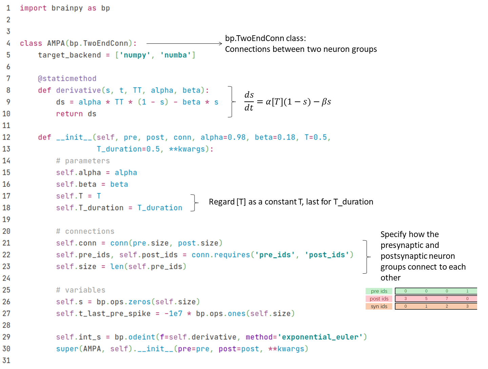
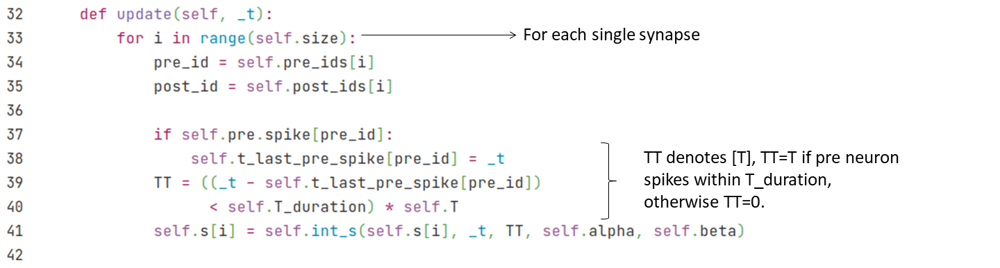
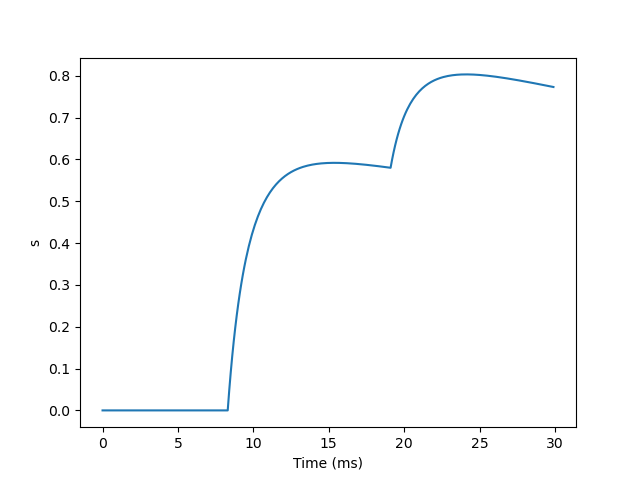

## 2.1 突触模型

我们在前面的章节中已经学习了如何建模神经元的动作电位，那么神经元之间是怎么连接起来的呢？神经元的动作电位是如何在不同神经元之间传导的呢？这里，我们将介绍如何用BrainPy对神经元之间的沟通进行模拟仿真。

### 2.1.1 化学突触

#### 生物背景

我们可以从图2-1这个生物突触的图中看到神经元之间信息传递的过程。当突触前神经元的动作电位传递到轴突的末端（terminal），它会往突触间隙释放**神经递质**（又称递质）。神经递质会和突触后神经元上的受体结合，从而引起突触后神经元膜电位的改变，这种改变成为突触后电位（PSP）。根据神经递质种类的不同，突触后电位可以是兴奋性或是抑制的。例如**谷氨酸**（Glutamate）就是一种重要兴奋性的神经递质，而**GABA**则是一种重要的抑制性神经递质。

神经递质与受体的结合可能会导致离子通道的打开（**离子型**受体）或改变化学反应的过程（**代谢型**受体）。

在本节中，我们将介绍如何使用BrainPy来实现一些常见的突触模型，主要有：

- **AMPA**和**NMDA**：它们都是谷氨酸的离子型受体，被结合后都可以直接打开离子通道。但是NMDA通常会被镁离子（Mg$$^{2+}$$）堵住，无法对谷氨酸做出反应。由于镁离子对电压敏感，当AMPA导致突触后电位改变到超过镁离子的阈值以后，镁离子就会离开NMDA通道，让NMDA可以对谷氨酸做出反应。因此，NMDA的反应是比较慢的。
- **GABA<sub>A</sub>**和**GABA<sub>B</sub>**：它们是GABA的两类受体，其中GABA<sub>A</sub>是离子型受体，通常可以产生快速的抑制性电位；而GABA<sub>B</sub>则为代谢型受体，通常会产生缓慢的抑制性电位。


<div style="text-align:center">
  
  <br>
    <strong> 图 2-1 生物突触 </strong> (引自 <cite>Gerstner et al., 2014 <sup><a href="#Gerstner2014">[1]</a></sup></cite>)
</div>
<div><br></div>

为了简便地建模从神经递质释放到引起突触后电位的这个过程，我们可以把神经递质释放、递质与受体结合、受体引起的变化这些过程概括为突触前神经元的动作电位变化如何引起突触后神经元膜上的离子通道变化，即用门控变量$$s$$来描述每当突触前神经元产生动作电位的时候，有多少比例的离子通道会被打开。我们首先来看看AMPA的例子。


#### AMPA模型

如前所述，AMPA（a-氨基-3-羟基-5-甲基-4-异恶唑丙酸）受体是一种离子型受体，也就是说，当它被神经递质结合后会立即打开离子通道，从而引起突触后神经元膜电位的变化。

我们可以用马尔可夫过程来描述离子通道的开关。如图2-2所示，$$s$$代表通道打开的概率，$$1-s$$代表离子通道关闭的概率，$$\alpha$$和$$\beta$$是转移概率（transition probability）。由于神经递质能让离子通道打开，所以从$$1-s$$到$$s$$的转移概率受神经递质浓度（以[T]表示）影响。

<div style="text-align:center">
   
  <br>	
  <strong> Fig. 2-2 离子通道动力学的马尔可夫过程 </strong>
</div>


<div><br></div>

把该过程用微分方程描述，得到以下式子。

$$
\frac {ds}{dt} = \alpha [T] (1-s) - \beta s
$$

其中，$$\alpha [T]$$ 表示从状态$$(1-s)$$到状态$$(s)$$的转移概率；$$\beta$$ 表示从$$s$$到$$(1-s)$$的转移概率。

下面我们来看看如何用BrainPy去实现这样一个模型。首先，我们要定义一个类，因为突触是连接两个神经元的，所以这个类继承自``bp.TwoEndConn``。在这个类中，和神经元模型一样，我们用一个``derivative``函数来实现上述微分方程，并在后面的``__init__``函数中初始化这个函数，指定用``bp.odeint``来解这个方程，并指定数值积分方法。由于这微分方程是线性的，我们选用``exponential_euler``方法。

> 首先，在突触中，我们需要``pre``和``post``来分别表示这个突触所连接的突触前神经元与突触后神经元。需要注意的是，``pre``和``post``都是向量，代表两群神经元，因此，我们还需要指定两群神经元具体链接情况的``conn``。在这里，我们可以从``conn``中获得连接矩阵``conn_mat``。



然后我们在``update``函数中更新$$s$$。



我们已经定义好了一个AMPA类，现在可以画出$$s$$随时间变化的图了。我们首先写一个``run_syn``函数来方便之后运行更多的突触模型，然后把AMPA类和需要自定义的变量传入这个函数来运行并画图。


运行以上代码，我们就会看到以下的结果：


由上图可以看出，当突触前神经元产生一个动作电位，$$s$$的值会先增加，然后衰减。


#### NMDA模型

如前所述，NMDA受体一开始被镁离子堵住，而随着膜电位的变化，镁离子又会移开，我们用$$c_{Mg}$$表示镁离子的浓度，它对突触后膜的电导$$g$$的影响可以由以下公式描述：

$$
g_{\infty} =(1+{e}^{-\alpha V} \cdot \frac{c_{Mg} } {\beta})^{-1}
$$

$$
g = \bar{g} \cdot g_{\infty}  s
$$

在此公式中，$$g_{\infty}$$的值随着镁离子浓度增加而减小。而随着电压$$V$$增加，$$g_{\infty}$$越来越不受镁离子的影响，建模了镁离子随电压增加而离开的效应。$$\alpha, \beta$$和$$\bar{g}$$是一些常数。门控变量$$s$$和AMPA模型类似，其动力学由以下公式给出：
$$
\frac{d s}{dt} =-\frac{s}{\tau_{\text{decay}}}+a x(1-s)
$$

$$
\frac{d x}{dt} =-\frac{x}{\tau_{\text{rise}}}
$$

$$
\text{if (pre fire), then} \ x \leftarrow x+ 1
$$

其中，$$\tau_{\text{decay}}$$和$$\tau_{\text{rise}}$$分别为$$s$$衰减及上升的时间常数，$$a$$是参数。

接下来我们用BrainPy来实现NMDA模型，代码如下。


由于前面我们已经定义了``run_syn``函数，在这里我们可以直接调用：

``` python
run_syn(NMDA)
```



由图可以看出，NMDA的上升和衰减过程都比AMPA模型更加缓慢。


#### GABA<sub>B</sub>模型

GABA<sub>B</sub>是一种代谢型受体，神经递质和受体结合后不会直接打开离子通道，而是通过G蛋白作为第二信使来起作用。因此，这里我们用$$[R]$$表示多少比例的受体被激活，并用$$[G]$$表示激活的G蛋白的浓度，$$s$$由$$[G]$$调节，公式如下：
$$
\frac{d[R]}{dt} = k_3 [T](1-[R])- k_4 [R]
$$

$$
\frac{d[G]}{dt} = k_1 [R]- k_2 [G]
$$

$$
s =\frac{[G]^{4}} {[G]^{4}+K_{d}}
$$

$$[R]$$的动力学类似于AMPA模型中$$s$$，受神经递质浓度$$[T]$$影响，$$k_3, k_4$$表示转移概率。$$[G]$$的动力学受$$[R]$$影响，并由参数$$k_1, k_2$$控制。$$K_d$$为一个常数。

用BrainPy实现的代码如下。


> （抑制性 -> E, I）


#### 指数及Alpha模型

由于许多突触模型都有类似AMPA突触那样先上升后下降的动力学特征，有时候我们建模不需要具体对应到生物学上的突触，因此，有人提出了一些抽象的突触模型。这里，我们会介绍四种这类抽象模型在BrainPy上的实现。这些模型在``Brain-Models``中也有现成的提供。

##### (1) 双指数差（Differences of two exponentials）

我们首先来看双指数差（Differences of two exponentials）模型，它的公式如下：

$$
s = \frac {\tau_1 \tau_2}{\tau_1 - \tau_2} (\exp(-\frac{t - t_s}{\tau_1})
- \exp(-\frac{t - t_s}{\tau_2}))
$$


在BrainPy的实现中，我们采用以下微分方程形式：

$$
		\frac {ds} {dt} = x
$$

$$
\frac {dx}{dt} =- \frac{\tau_1+\tau_2}{\tau_1 \tau_2}x - \frac s {\tau_1 \tau_2}
$$

$$
\text{if (fire), then} \ x \leftarrow x+ 1
$$


这里我们把判断当突触前神经元有发放时，$$x$$增加的逻辑写到``update``函数中。代码如下：


```python
class Two_exponentials(bp.TwoEndConn):
    target_backend = 'general'

    @staticmethod
    def derivative(s, x, t, tau1, tau2):
        dxdt = (-(tau1 + tau2) * x - s) / (tau1 * tau2)
        dsdt = x
        return dsdt, dxdt
    
    def __init__(self, pre, post, conn, tau1=1.0, tau2=3.0, **kwargs):
        # parameters
        self.tau1 = tau1
        self.tau2 = tau2

        # connections
        self.conn = conn(pre.size, post.size)
        self.conn_mat = conn.requires('conn_mat')
        self.size = bp.ops.shape(self.conn_mat)

        # variables
        self.s = bp.ops.zeros(self.size)
        self.x = bp.ops.zeros(self.size)

        self.integral = bp.odeint(f=self.derivative, method='rk4')
        
        super(Two_exponentials, self).__init__(pre=pre, post=post, **kwargs)
    
    def update(self, _t):
        self.s, self.x = self.integral(self.s, self.x, _t, self.tau1, self.tau2)
        self.x += bp.ops.unsqueeze(self.pre.spike, 1) * self.conn_mat
```


```python
neu1 = bm.neurons.LIF(2, monitors=['V'])
neu2 = bm.neurons.LIF(3, monitors=['V'])
syn = Two_exponentials(tau1=2., pre=neu1, post=neu2, conn=bp.connect.All2All(), monitors=['s'])

net = bp.Network(neu1, syn, neu2)
net.run(30., inputs=(neu1, 'input', 35.))
bp.visualize.line_plot(net.ts, syn.mon.s, ylabel='s', show=True)
```


##### (2) Alpha突触

Alpha突触和上述模型类似，唯独在这里$$\tau_1 = \tau_2$$，因此公式更加简化了：

$$
\frac {ds} {dt} = x
$$

$$
 \frac {dx}{dt} =- \frac{2x}{\tau} - \frac s {\tau^2}
$$

$$
\text{if (fire), then} \ x \leftarrow x+ 1
$$

代码实现也类似：


```python
class Alpha(bp.TwoEndConn):
    target_backend = 'general'

    @staticmethod
    def derivative(s, x, t, tau):
        dxdt = (-2 * tau * x - s) / (tau ** 2)
        dsdt = x
        return dsdt, dxdt
    
    def __init__(self, pre, post, conn, tau=3.0, **kwargs):
        # parameters
        self.tau = tau

        # connections
        self.conn = conn(pre.size, post.size)
        self.conn_mat = conn.requires('conn_mat')
        self.size = bp.ops.shape(self.conn_mat)

        # variables
        self.s = bp.ops.zeros(self.size)
        self.x = bp.ops.zeros(self.size)

        self.integral = bp.odeint(f=self.derivative, method='rk4')
        
        super(Alpha, self).__init__(pre=pre, post=post, **kwargs)
    
    def update(self, _t):
        self.s, self.x = self.integral(self.s, self.x, _t, self.tau)
        self.x += bp.ops.unsqueeze(self.pre.spike, 1) * self.conn_mat
```


```python
neu1 = bm.neurons.LIF(2, monitors=['V'])
neu2 = bm.neurons.LIF(3, monitors=['V'])
syn = Alpha(pre=neu1, post=neu2, conn=bp.connect.All2All(), monitors=['s'])

net = bp.Network(neu1, syn, neu2)
net.run(30., inputs=(neu1, 'input', 35.))
bp.visualize.line_plot(net.ts, syn.mon.s, ylabel='s', show=True)
```


##### (3) 单指数衰减（Single exponential decay）

有时候在建模中可以忽略上升的过程，而只需要建模衰退（decay）的过程。这种模型称为单指数衰减（Single exponential decay）模型，其公式就更加简化了：

$$
\frac {ds}{dt}=-\frac s {\tau_{decay}}
$$

$$
\text{if (fire), then} \ s \leftarrow s+1
$$

代码实现如下：


```python
class Exponential(bp.TwoEndConn):
    target_backend = 'general'

    @staticmethod
    def derivative(s, t, tau):
        ds = -s / tau
        return ds
    
    def __init__(self, pre, post, conn, tau=8.0, **kwargs):
        # parameters
        self.tau = tau

        # connections
        self.conn = conn(pre.size, post.size)
        self.conn_mat = conn.requires('conn_mat')
        self.size = bp.ops.shape(self.conn_mat)

        # variables
        self.s = bp.ops.zeros(self.size)
        
        self.integral = bp.odeint(f=self.derivative, method='exponential_euler')
        
        super(Exponential, self).__init__(pre=pre, post=post, **kwargs)


    def update(self, _t):
        self.s = self.integral(self.s, _t, self.tau)
        self.s += bp.ops.unsqueeze(self.pre.spike, 1) * self.conn_mat
```


```python
neu1 = bm.neurons.LIF(2, monitors=['V'])
neu2 = bm.neurons.LIF(3, monitors=['V'])
syn = Exponential(pre=neu1, post=neu2, conn=bp.connect.All2All(), monitors=['s'])

net = bp.Network(neu1, syn, neu2)
net.run(30., inputs=(neu1, 'input', 35.))
bp.visualize.line_plot(net.ts, syn.mon.s, ylabel='s', show=True)
```


##### （4）电压跳变（Voltage jump）

建模上，有时候甚至连衰退的过程也可以忽略，这样的模型成为电压跳变（Voltage jump）模型，公式如下：

$$
\text{if (fire), then} \ V \leftarrow V+1
$$

在实现上，连微分方程都不需要了，只需要在``update``函数中更新突触后膜的膜电位。但是，由于更新的是膜电位，因此要主要当突触后神经元为LIF等具有不应期的神经元时，不应期的时候不会改变膜电位。代码如下：


```python
class Voltage_jump(bp.TwoEndConn):        
    target_backend = 'general'

    def __init__(self, pre, post, conn, post_refractory=False,  **kwargs):
        # parameters
        self.post_refractory = post_refractory

        # connections
        self.conn = conn(pre.size, post.size)
        self.conn_mat = conn.requires('conn_mat')
        self.size = bp.ops.shape(self.conn_mat)

        # variables
        self.s = bp.ops.zeros(self.size)
        
        super(Voltage_jump, self).__init__(pre=pre, post=post, **kwargs)
    
    def update(self, _t):
        self.s = bp.ops.unsqueeze(self.pre.spike, 1) * self.conn_mat
             
        if self.post_refractory:
            refra_map = (1. - bp.ops.unsqueeze(self.post.refractory, 0)) * self.conn_mat
            self.post.V += bp.ops.sum(self.s * refra_map, axis=0)
        else:
            self.post.V += bp.ops.sum(self.s, axis=0)
```


```python
neu1 = bm.neurons.LIF(2, monitors=['V'])
neu2 = bm.neurons.LIF(3, monitors=['V'])
syn = Voltage_jump(pre=neu1, post=neu2, conn=bp.connect.All2All(), monitors=['s'])

net = bp.Network(neu1, syn, neu2)
net.run(30., inputs=(neu1, 'input', 35.))
bp.visualize.line_plot(net.ts, syn.mon.s, ylabel='s', show=True)
```


#### 基于电流的和基于电导的突触

前面我们已经建模了门控变量$$s$$。有两种不同的方法来建模从$$s$$到突触电流$$I$$（即突触后神经元的输入电流）的关系，分别为
**基于电流的（current-based）**
与**基于电导的（conductance-based）**。两者的主要区别在于突触电流是否受突触后神经元膜电位的影响。

基于电流的模型公式如下：

$$
I \propto s
$$

在代码实现上，我们通常会乘上一个权重$$w$$，我们可以通过调整权重的正负值来实现兴奋性和抑制性突触。

这里还通过使用BrainPy提供的``register_constant_delay``函数给变量``I_ syn``加上延迟时间来实现突触的延迟。


```python
def __init__(self, pre, post, conn, **kwargs):
    # ...
    self.s = bp.ops.zeros(self.size)
    self.w = bp.ops.ones(self.size) * .2
    self.I_syn = self.register_constant_delay('I_syn', size=self.size, delay_time=delay)

def update(self, _t):
    for i in nb.prange(self.size):
        # ... 
        self.I_syn.push(i, self.w[i] * self.s[i])
        self.post.input[post_id] += self.I_syn.pull(i) 
```

在基于电导的模型中，电导为$$g=\bar{g}s$$。因此，根据欧姆定律得公式如下：

$$
I=\bar{g}s(V-E)
$$

这里$$E$$是一个反转电位（reverse potential），它可以决定$$I$$的方向是抑制还是兴奋。例如，当静息电位约为-65时，减去比它更低的$$E$$，例如-75，将变为正，从而改变公式中电流的方向并产生抑制电流。兴奋性突触的$$E$$一般为比较高的值，如0。

代码实现上，可以把延迟时间应用到变量``g``上。


```python
def __init__(self, pre, post, conn, g_max, E, **kwargs):
    self.g_max = g_max
    self.E = E
    # ...
    self.s = bp.ops.zeros(self.size)
    self.g = self.register_constant_delay('g', size=self.size, delay_time=delay)

def update(self, _t):
    for i in nb.prange(self.size):
        # ...
        self.g.push(i, self.g_max * self.s[i])
        self.post.input[post_id] -= self.g.pull(i) * (self.post.V[post_id] - self.E)
```

### 电突触（缝隙连接 Gap junction）

除了前面介绍的化学突触以外，电突触在我们神经系统中也很常见。


如上图，两个神经元通过连接通道 (junction channels) 相连，可以直接导电。因此，可以看作是两个神经元由一个常数电阻连起来，如下图所示。


根据欧姆定律可得以下公式。

$$
I_{1} = w (V_{0} - V_{1})
$$

这里电导表示为$$w$$，它表示连接的权重。

在BrainPy的实现中，只需要在``update``函数里更新即可。


```python
class Gap_junction(bp.TwoEndConn):
    target_backend = 'general'

    def __init__(self, pre, post, conn, delay=0., k_spikelet=0.1, post_refractory=False,  **kwargs):
        self.delay = delay
        self.k_spikelet = k_spikelet
        self.post_refractory = post_refractory

        # connections
        self.conn = conn(pre.size, post.size)
        self.conn_mat = conn.requires('conn_mat')
        self.size = bp.ops.shape(self.conn_mat)

        # variables
        self.w = bp.ops.ones(self.size)
        self.spikelet = self.register_constant_delay('spikelet', size=self.size, delay_time=delay)

        super(Gap_junction, self).__init__(pre=pre, post=post, **kwargs)

    def update(self, _t):
        v_post = bp.ops.vstack((self.post.V,) * self.size[0])
        v_pre = bp.ops.vstack((self.pre.V,) * self.size[1]).T

        I_syn = self.w * (v_pre - v_post) * self.conn_mat
        self.post.input += bp.ops.sum(I_syn, axis=0)

        self.spikelet.push(self.w * self.k_spikelet * bp.ops.unsqueeze(self.pre.spike, 1) * self.conn_mat)

        if self.post_refractory:
            self.post.V += bp.ops.sum(self.spikelet.pull(), axis=0) * (1. - self.post.refractory)
        else:
            self.post.V += bp.ops.sum(self.spikelet.pull(), axis=0)
```


```python
import matplotlib.pyplot as plt
import numpy as np

neu0 = bm.neurons.LIF(2, monitors=['V'], t_refractory=0)
neu0.V = np.ones(neu0.V.shape) * -10.
neu1 = bm.neurons.LIF(3, monitors=['V'], t_refractory=0)
neu1.V = np.ones(neu1.V.shape) * -10.
syn = Gap_junction(pre=neu0, post=neu1, conn=bp.connect.All2All(),
                    k_spikelet=5.)
syn.w = np.ones(syn.w.shape) * .5

net = bp.Network(neu0, neu1, syn)
net.run(100., inputs=(neu0, 'input', 30.))

fig, gs = bp.visualize.get_figure(row_num=2, col_num=1, )

fig.add_subplot(gs[1, 0])
plt.plot(net.ts, neu0.mon.V[:, 0], label='V0')
plt.legend()

fig.add_subplot(gs[0, 0])
plt.plot(net.ts, neu1.mon.V[:, 0], label='V1')
plt.legend()
plt.show()
```


