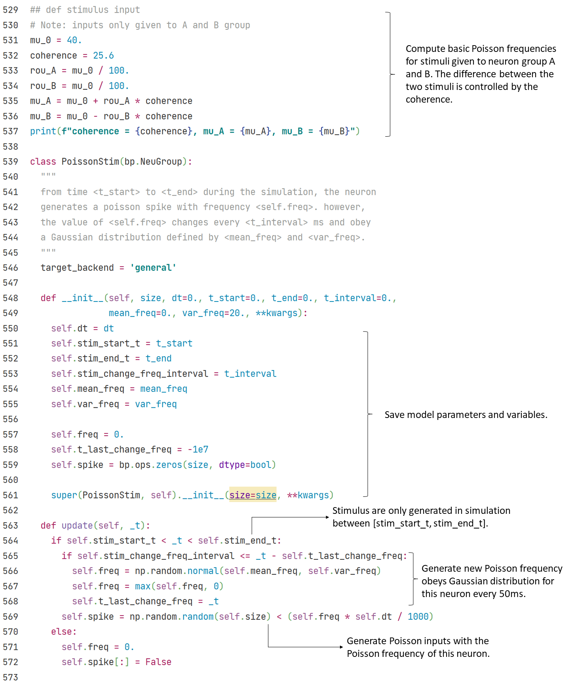

## 3.1 Spiking Neural Network

### 3.1.1 E/I balanced network

In 1990s, biologists found in experiments that neuron activities in brain cortex show a temporal irregular spiking pattern. This pattern exists widely in brain areas, but researchers knew few about its mechanism or function.

Vreeswijk and Sompolinsky (1996) proposed E/I balanced network to explain this irregular spiking pattern. The feature of this network is the strong, random and sparse synapse connections between neurons. Because of this feature and corresponding parameter settings, each neuron in the network will receive great excitatory and inhibitory input from within the network, but these two types of input will cancel each other, and maintain the total internal input at a relatively small order of magnitude, which is only enough to generate action potentials.

The randomness and noise in E/I balanced network give an internal input which varies with time and space at the order of threshold potential to each neuron in the network. Therefore, the firing of neurons also has randomness,  ensures that E/I balanced network can generate temporal irregular firing pattern spontaneously.

Vreeswijk and Sompolinsky also suggested a possible function of this irregular firing pattern: E/I balanced network can respond to the changes of external stimulus quickly.

When there is no external input, the distribution of neurons’ membrane potentials in E/I balanced network follows a relatively uniform random distribution between resting potential and threshold potential.

When we give the network a small constant external stimulus, there are always some neurons whose membrane potentials fall near the threshold potential. Turn the stimulus on and these neurons will soon meet the threshold, therefore spike rapidly. On the network scale, the firing rate of neurons in the network can adjust rapidly once the input changes.

Simulation suggests that the delay of network response to input is the same order of magnitude as synapse delay, and is significantly less than the delay of a single neuron that facing the same stimulus at resting potential generates a spike.

As a result, we say E/I balanced network may provide a fast response mechanism for neural networks. 

<b>Fig.3-2 Structure of E/I balanced network</b>

Fig. 3-2 shows the structure of E/I balanced network:

1)	Neurons: LIF neurons are used in the network. The neurons can be divided into excitatory neurons and inhibitory neurons, the number of two types of neurons are $$N_E$$: $$N_I$$ = 4:1.

2)	Synapses: Exponential synapses are used in the network. 4 groups of synapse connections are generated between the two groups of neurons, that is, excitatory-excitatory connection (E2E conn), excitatory-inhibitory connection (E2I conn), inhibitory-excitatory connection (I2E conn) and inhibitory-inhibitory connection (I2I conn). To express the excitatory or inhibitory of the synapse connections, we define synapse weight with different signal.

	

3)	Inputs: All neurons in the network receive a constant input current from outside of network.

	

See above section 1 and 2 for definition of LIF neuron class and Exponential synapse class. Visualize the simulation result of E/I balanced network, the network firing rate changes from strong synchronization to irregular fluctuation.

	

<b>Fig.3-3 E/I balanced net raster plot</b>

### 3.1.2 Decision Making Network

The modeling of computational neuroscience networks can correspond to specific physiological tasks, like the visual motion discrimination task (Roitman and Shadlen, 2002). In this task, rhesus watch a video in which random dots move towards left or right with definite coherence. Rhesus are required to choose the direction that most dots move to and give their answer by saccade. At the meantime, researchers record the activity of their LIF neurons by implanted electrode.

 

<b>Fig.3-4 Experimental Disgram</b>

Wang (2002) proposed a decision making network to model the activity of rhesus LIF neurons during decision making period. As shown in Fig. 3-5, this network is based on E/I balanced network, with excitatory neuron and inhibitory neuron number in the proportion 4:1, and maintain the balanced state by adjusting parameters.

Among the excitatory neuron group, two selective subgroup are chosen, both with a size of 0.15 * N_E. These two subgroups are marked as A and B in Fig. 3-5. Other excitatory neuron are non-selective.

<b>Fig.3-5 structure of decision makingnetwork</b>

	

As it is in E/I balanced network, synapses can be classified into E2E connection, E2I connection, I2E connection and I2I connection. Excitatory connections are realized with AMPA synapse, inhibitory connections are realized with GABAa synapse. In order to force the network to make decisions between group A and group B, E2E connections are structured. As shown in Sheet 3-1, the strength of synapse connections is higher in the same selective subgroup, and lower between two subgroups or between selective and non-selective subgroup.

<b>Sheet 3-1 Weight of synapse connections between E-neurons</b>

	

We give two types of external inputs to the decision making network:

1) Background inputs from other brain areas without specific meaning. Represented as high frequency Poisson input mediated by AMPA synapse; 

	

2) Stimulus inputs from outside the brain, which are given only to the two selective subgroup A and B. Represented as lower frequency Poisson input mediated by AMPA synapse. To simulate the proportion difference of the dots moving to left and right in physiological experiments, the stimulus frequencies given to A and B group have a certain difference.

	

	

During the simulation, group A receive a larger stimulus input than group B (i.e. more random dot move to the direction represented by A), later, considerable differentiation are found between the population activities of the two selective subgroups. In example below, the activity of group A is higher than group B, which means, the network choose the right direction receives higher stimulus.

<b>Fig.3-6 decision making network</b>
