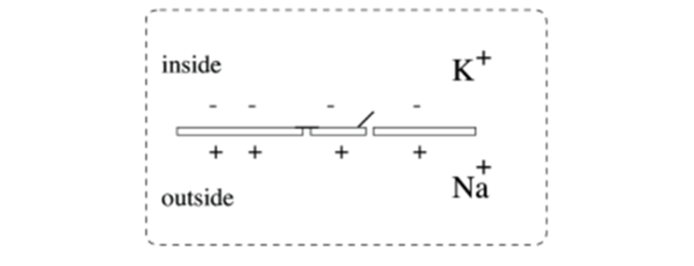

## 1.1 Biophysical models

### 1.1.1 Hodgkin-Huxley model

Hodgkin and Huxley (1952) recorded the generation of action potential on squid giant axons with voltage clamp technique, and proposed the canonical neuron model called Hudgin-Huxley model (HH model). 

<center>	</center>

<center><b> Fig. 1-1 Neuron membrane | NeuroDynamics </b></center>

Fig. 1-1 is a general diagram of neuron membrane with phospholipid bilayer and ion channels. The Na+ ion concentration is higher out of the neuron, and K+ ion concentration is higher in the neuron. Intracellular potential is  lower than extracellular potential.

<center>	</center>

<center><b>Fig. 1-2 Equivalent circuit diagram | NeuroDynamics </b></center>

The equivalent circuit diagram of Fig.1-1 is shown in Fig. 1-2, in which the battery $E_L$ refers to the potential difference across membrane, electric current $I$ refers to the external stimulus, capacitance $C$ refers to the hydrophobic phospholipid bilayer with low conductance, resistance $R$ refers to the resistance correspond to leaky current, i.e. the resistance of all non-specific ion channels. 

As Na+ ion channel and K+ ion channel are important in the generation of action potentials, these two ion channels are modeled as the two resistances $R_{Na}$ and $R_K$ in parallel on the right side of the circuit diagram, and the two batteries $E_{Na}$ and $E_K$ refer to the ion potential differences caused by ion concentration differences of Na+ and K+, respectively.

Consider the Kirchhoff’s first law, that is,  for any node in an electrical circuit, the sum of currents flowing into that node is equal to the sum of currents flowing out of that node, Fig. 1-2 can be modeled as differential equations:

$$ C \frac{dV}{dt} = -(\bar{g}_{Na} m^3 h (V - E_{Na}) + \bar{g}_K n^4(V - E_K) + g_{leak}(V - E_{leak})) + I(t) $$

$$\frac{dx}{dt} = \alpha_x(1-x) - \beta_x , x \in \{ Na, K, leak \} $$

That is the HH model. Note that in equation 1, HH model introduces three gating variables m, n and h to control the open/close state of ion channels. To be accurate, variables m and h control the state of Na+ ion channel, and variable n control the state of K+ ion channel. Gating variable dynamics can be expressed in Markov-like form, in which $\alpha_x$ refers to the activation rate of gating variable x, and $\beta_x$ refers to the de-activation rate of x. The expressions of $\alpha_x$ and $\beta_x$ (as shown in equations below) are fitted by experimental data.

$$ \alpha_m(V) = \frac{0.1(V+40)}{1 - exp(\frac{-(V+40)}{10})}$$

$$ \beta_m(V) = 4.0 exp(\frac{-(V+65)}{18})$$

$$ \alpha_h(V) = 0.07 exp(\frac{-(V+65)}{20})$$

$$ \beta_h(V) = \frac{1}{1 + exp(\frac{-(V + 35)}{10})}$$

$$ \alpha_n(V) = \frac{0.01(V+55)}{1 - exp(\frac{-(V+55)}{10})}$$

$$ \beta_n(V) = 0.125 exp(\frac{-(V+65)}{80})$$

How can the users transform these differential equations to code with BrainPy? Take HH model as an example, we may look closely at this process.

**************************

*Note: Readers should pay special attention to discriminate between the terms “model parameters”, “model variables” in dynamic systems and the terms “parameters”, “variables” in programming.*

In BrainPy, users define neuron and synapse models as Python classes. All the classes users may use, as shown in Fig. 1-3, derive from one base class `DynamicSystem`. A neuron model should inherit from the subclass `NeuGroup` of `DynamicSystem` class, and synapse model should inherit from the subclass `TwoEndConn` or `ThreeEndConn`, rely on the number of neurons connected by a single synapse.

<center></center> 

<center><b> Fig. 1-3 Class inheritance of BrainPy </b></center>

As for HH neuron model, the `HH` class should inherit from `NeuGroup` class. Objects of `HH` class represent groups of HH neuron, and every single neuron in the group will be computed separately. 

    class HH(bp.NeuGroup):
        target_backend = 'general'

Firstly, in HH class definition, users may set variable `target_backend` to specify backend. The value can be set as `general`, which means any backend is supported; it can also be set as a list of backend names:

        target_backend = ['numpy', 'numba', 'pytorch']

The code implementation of model rely on the backend. For example, the acceleration mechanism of `PyTorch` differs from `Numba`, so we may realize the same model differently to maximize the accelerate effect.

Next, we define the differential equation in `derivative` method. Users pass the model variables, time stamp `t` and other model parameters to `derivative` method, BrianPy will classify this three types by the incoming parameter order and integrate the model variables only.

        @staticmethod
        def derivative(V, m, h, n, t, C, gNa, ENa, gK, EK, gL, EL, Iext):
            alpha_m = 0.1 * (V + 40) / (1 - bp.ops.exp(-(V + 40) / 10))
            beta_m = 4.0 * bp.ops.exp(-(V + 65) / 18)
            dmdt = alpha_m * (1 - m) - beta_m * m
            
            dhdt = ...
            
            dndt = ...
    
            I_Na = (gNa * m ** 3.0 * h) * (V - ENa)
            I_K = (gK * n ** 4.0) * (V - EK)
            I_leak = gL * (V - EL)
            dVdt = (- I_Na - I_K - I_leak + Iext) / C
    
            return dVdt, dmdt, dhdt, dndt

In the method, we compute the right hand of HH equations (1) – (8), and return $dV/dt$, $dm/dt$, $dn/dt$, $dh/dt$ in order.

However, if you are familiar with numerical integration, you may find that we have not transform the derivatives $dx/dt$ into update processes from $x(t)$ to $x(t+1)$. Don't worry, BrainPy will automatically complete this step of transformation, the details will soon be explained in the constructor.

The contructor of HH class `__init__` needs three types of incoming parameters:

1)	Parameter 	`size`: the number of neurons contained by a class object. Ex. If `size=100`, this object of HH neuron group will include 100 HH neurons.

2)	Parameter list `E_Na` ~ `V_th`: a list of model parameters relies on the model. The number and value of model parameters in this list vary according to the model.

3)	Key word arguments list `**kwargs`: Variable dictionary of key word arguments. `**kwargs` are passed to superclass `NeuGroup` at the end of constructor, and are handled by the super class.

        def __init__(self, size, ENa=50., gNa=120., EK=-77., gK=36.,
                 EL=-54.387, gL=0.03, V_th=20., C=1.0, **kwargs):
            # parameters
            self.ENa = ENa
            ...
            self.V_th = V_th
    
            # variables
            self.V = -65. * bp.ops.ones(size)
            self.m = 0.5 * bp.ops.ones(size)
            self.h = 0.6 * bp.ops.ones(size)
            self.n = 0.32 * bp.ops.ones(size)
            self.spike = bp.ops.zeros(size, dtype=bool)
            self.input = bp.ops.zeros(size)
    
            # numerical solver
            self.integral = bp.odeint(f=self.derivative)
            super(HH, self).__init__(size=size, **kwargs)

The difference between model parameters (`ENa`, `gNa`, etc.) and model variables (`V`, `m`, `n`, etc.) is, model parameters are only sensitive to the model, but model variables also consider the number of neurons in this neuron group. As shown in Fig. 1-5, if 100 HH neurons are included in one object, then each model parameter is a floating point number, while each model variable is saved in memory as a floating point vector with length 100.

<center> </center>

<center><b>Fig.1-5 model memory</b></center>

Then we define the numerical method `integral`. Call `odeint` function provided by BrainPy to specify the numerical method are to be used, and `odeint` function will recompile `derivative` method, transform the derivatives to variable update processes. 

BrainPy supports several numerical integration methods including Euler method, Ronge-Kutta method, etc. Users may choose a method with parameter `method`.

        self.integral = bp.odeint(f=self.derivative, method='exponential_euler')

At the end of constructor, pass parameter `size` and `**kwargs` to super class `NeuGroup`, finish the initialization of HH class.

    def update(self, _t):
        V, m, h, n = self.integral(self.V, self.m, self.h, self.n, _t,
                          self.C, self.gNa, self.ENa, self.gK,
                          self.EK, self.gL, self.EL, self.input)
        self.spike = (self.V < self.V_th) * (V >= self.V_th)
        self.V = V
        self.m = m
        self.h = h
        self.n = n
        self.input[:] = 0

Define `update` method of HH class. Simulation is a series of computing operations on discrete time series, so in `update` method we tell BrainPy what to do on each time step. As for HH model, we call `integral` method to update variables `V`, `m`, `n`, `h`, judge if there are spikes on each neuron and reset the external input of current moment.

To use a well-defined HH class, we instantiate a neuron group with 100 HH neurons. The parameter `monitors` is passed into super class `NeuGroup` as `**kwargs`. All the model variables marked by the monitor list will be recorded by BrainPy during the simulation, and users can access the records later as `neu.mon.*`.

    neu = HH(100, monitors=['V'])
    net = bp.Network(neu)
    net.run(200., inputs=(neu, 'input', 10.))
    
    bp.visualize.line_plot(neu.mon.ts, neu.mon.V, show=True)

Pass neuron group object `neu` to class `Network`, instantiate a network object `net` including this neuron group. Call method `run` of class `Network`, simulate for 200 ms and give all the neurons  external inputs of amplitude 10 during the simulation. After, users may call the `visualize` module of BrainPy to display the results.


```python
import brainpy as bp

class HH(bp.NeuGroup):
    target_backend = 'general'

    @staticmethod
    def derivative(V, m, h, n, t, C, gNa, ENa, gK, EK, gL, EL, Iext):
        alpha = 0.1 * (V + 40) / (1 - bp.ops.exp(-(V + 40) / 10))
        beta = 4.0 * bp.ops.exp(-(V + 65) / 18)
        dmdt = alpha * (1 - m) - beta * m

        alpha = 0.07 * bp.ops.exp(-(V + 65) / 20.)
        beta = 1 / (1 + bp.ops.exp(-(V + 35) / 10))
        dhdt = alpha * (1 - h) - beta * h

        alpha = 0.01 * (V + 55) / (1 - bp.ops.exp(-(V + 55) / 10))
        beta = 0.125 * bp.ops.exp(-(V + 65) / 80)
        dndt = alpha * (1 - n) - beta * n

        I_Na = (gNa * m ** 3.0 * h) * (V - ENa)
        I_K = (gK * n ** 4.0) * (V - EK)
        I_leak = gL * (V - EL)
        dVdt = (- I_Na - I_K - I_leak + Iext) / C

        return dVdt, dmdt, dhdt, dndt

    def __init__(self, size, ENa=50., gNa=120., EK=-77., gK=36.,
                 EL=-54.387, gL=0.03, V_th=20., C=1.0, **kwargs):
        # parameters
        self.ENa = ENa
        self.EK = EK
        self.EL = EL
        self.gNa = gNa
        self.gK = gK
        self.gL = gL
        self.C = C
        self.V_th = V_th

        # variables
        num = bp.size2len(size)
        self.V = -65. * bp.ops.ones(num)
        self.m = 0.5 * bp.ops.ones(num)
        self.h = 0.6 * bp.ops.ones(num)
        self.n = 0.32 * bp.ops.ones(num)
        self.spike = bp.ops.zeros(num, dtype=bool)
        self.input = bp.ops.zeros(num)

        # numerical solver
        self.integral = bp.odeint(f=self.derivative, method='exponential_euler')
        super(HH, self).__init__(size=size, **kwargs)

    def update(self, _t):
        V, m, h, n = self.integral(self.V, self.m, self.h, self.n, _t,
                                   self.C, self.gNa, self.ENa, self.gK,
                                   self.EK, self.gL, self.EL, self.input)
        self.spike = (self.V < self.V_th) * (V >= self.V_th)
        self.V = V
        self.m = m
        self.h = h
        self.n = n
        self.input[:] = 0
```


```python
import brainpy as bp

neu = HH(100, monitors=['V'])
net = bp.Network(neu)
net.run(200., inputs=(neu, 'input', 5.))

bp.visualize.line_plot(neu.mon.ts, neu.mon.V, show=True)
```


The V-t plot of HH model simulated with BrainPy is painted above. During an action potential of HH model, there is four periods: integrate, spike, reset and refractory period.

These periods are similar to the typical behavior of neurons found in biophysical experiments, and can be mapped to the equations. For example, the existence of refractory period is because of the different activation and de-activation rate of gating variables.
