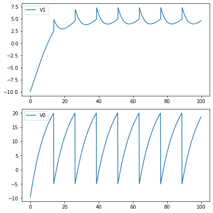

## 2.1 Synaptic Models

In the previous section, we learned how to model neurons and their action potentials. In this section, we will focus on how neurons communicates.

### 2.1.1 Chemical Synapses

#### Biological Background

Fig. 2-1 shows the biological process of information transmission between neurons. The action potential of the presynaptic neuron makes the axon terminal release **neurotransmitters** (also called transmitter) into the synaptic cleft, and then the membrane potential of the postsynaptic cell changes after a brief delay. These changes are called postsynaptic potentials (PSP), and they can be either excitatory or inhibitory depending on the type of transmitter. **Glutamate** is one of the important excitatory neurotransmitters, and Gamma-aminobutyric acid (**GABA**) is one of the important inhibitory neurotransmitters.

Neurotransmitters affect their targets by interacting with receptors in the postsynaptic membrane. When the transmitter binds to the receptor, it would either open an ion channel (**ionotropic** receptors) or alter chemical reactions within the target cell (**metabotropic** receptors).

In this section, we will introduce how to model some common synapses and their implementations with ``BrainPy``:

- **AMPA** and **NMDA** receptors are both ionotropic receptors of Glutamate, but the NMDA receptor are typically blocked by magnesium ions (Mg$$^{2+}$$) and cannot respond to the glutamate. With repeated activation of AMPA receptors, the change in postsynaptic potential drives Mg$$^{2+}$$ out of NMDA channel, then the NMDA receptors are able to respond to glutamate. Therefore, NMDA is must slower than AMPA.

- **GABA<sub>A</sub>** and **GABA<sub>B</sub>** are two classes of GABA receptors. GABA<sub>A</sub> receptors are ionotropic, typically producing fast inhibitory postsynaptic potential; while GABA<sub>B</sub> receptors are metabotropic receptors, typically producing a slow-occurring inhibitory postsynaptic potential.


<div style="text-align:center">
  
  <br>
    <strong> Fig. 2-1 Biological Synapse </strong> (Adaptive from <cite>Gerstner et al., 2014 <sup>[1]</sup></cite>)
</div>
<div><br></div>

In order to keep things simple, we use gating variable ``s`` to describe how many portion of ion channels will open whenever a presynaptic spike arrives while modeling. We will first introduce AMPA receptor as an example to show how to develop synapse models and implement with ``BrainPy``.


#### AMPA Synapse

As we mentioned before, the AMPA receptor is an ionotropic receptor, that is, when a neurotransmitter binds to it, the ion channel will be opened immediately to allow Na$$^+$$ and K$$^+$$ ions flux.

We can use Markov process to describe the opening and closing process of ion channels. As shown in Fig. 2-2,  $$s$$ represents the probability of channel opening, $$1-s$$ represents the probability of ion channel closing, and $$\alpha$$ and $$\beta$$ are the transition probability. Because neurotransmitters can open ion channels, the transfer probability from $$1-s$$ to $$s$$ is affected by the concentration of neurotransmitters. We denote the concentration of neurotransmitters as [T].

<div style="text-align:center">
   
  <br>	
  <strong> Fig. 2-2 Markov process of channel dynamics </strong>
</div>

<div><br></div>

We obtained the following formula when describing the process by a differential equation.

$$
\frac {ds}{dt} = \alpha [T] (1-s) - \beta s
$$

Where $$\alpha [T]$$ denotes the transition probability from state $$(1-s)$$ to state $$(s)$$; and $$\beta$$ represents the transition probability of the other direction.

Now let's see how to implement such a model with BrainPy. First of all, we need to define a class that inherits from`` bp.TwoEndConn ``, because synapses connect two neurons. 

Within the class, we can define the differential equation with ``derivative`` function, this is the same as the definition of neuron models.

``` python
import brainpy as bp

class AMPA(bp.TwoEndConn):
    target_backend = ['numpy', 'numba']

    @staticmethod
    def derivative(s, t, TT, alpha, beta):
        ds = alpha * TT * (1 - s) - beta * s
        return ds

    def __init__(self, pre, post, conn,
                 alpha=0.98, beta=0.18, T=0.5, T_duration=0.5, **kwargs):
        # parameters
        self.alpha = alpha
        self.beta = beta
        self.T = T
        self.T_duration = T_duration

        # connections
        self.conn = conn(pre.size, post.size)
        self.pre_ids, self.post_ids = conn.requires('pre_ids', 'post_ids')
        self.size = len(self.pre_ids)

        # variables
        self.s = bp.ops.zeros(self.size)
        self.t_last_pre_spike = -1e7 * bp.ops.ones(self.size)

        self.int_s = bp.odeint(f=self.derivative, method='exponential_euler')
        super(AMPA, self).__init__(pre=pre, post=post, **kwargs)
        
    def update(self, _t):
        for i in range(self.size):
            pre_id = self.pre_ids[i]
            post_id = self.post_ids[i]

            if self.pre.spike[pre_id]:
                self.t_last_pre_spike[pre_id] = _t
            TT = ((_t - self.t_last_pre_spike[pre_id]) < self.T_duration) * self.T
            self.s[i] = self.int_s(self.s[i], _t, TT, self.alpha, self.beta)
```

We use the``__ init__ ``Function to initialize the required parameters and variables. First, in a synapse, we need ``pre`` and ``post`` to specify the presynaptic neurons and postsynaptic neurons connected by the synapse, respectively. It should be noted that both ``pre`` and ``post`` are vectors, representing two groups of neurons. Therefore, we also need to specify the connections between the two neuron groups. There are several connections methods provided by BrainPy, in ``numba`` backend, we can get ``pre_ids`` and ``post_ids`` from ``conn.requires``. 

For parameters and variables of the AMPA synapse, we would see that there is a concentration of neurotransmitter [T] in the formula. In order to simplify the calculation, [T] can be regarded as a constant, which is determined by ``T_duration`` controls how long it lasts. Therefore, our simplified implementation is that every time the presynaptic neuron fires, it will release neurotransmitters that maintain ``T_duration`` until being cleared. So we just need to judge if it's at ``T_duration``, then [T] = T, otherwise [T] = 0. Then the judgment process needs to use a variable ``t_last_pre_spike`` to record the last firing time of presynaptic neurons.

After the implementation, we can plot the graph of $$s$$ changing with time. We would first write a ``run_syn`` function to run and plot the graph. To run a synapse, we need neuron groups, so we use the LIF neuron provided by ``brainmodels`` package.

``` python
import brainmodels as bm
bp.backend.set(backend='numba', dt=0.1)

def run_syn(syn_model, **kwargs):
    neu1 = bm.neurons.LIF(2, monitors=['V'])
    neu2 = bm.neurons.LIF(3, monitors=['V'])
    
    syn = syn_model(pre=neu1, post=neu2, conn=bp.connect.All2All(), monitors=['s'], **kwargs)

    net = bp.Network(neu1, syn, neu2)
    net.run(30., inputs=(neu1, 'input', 35.))
    bp.visualize.line_plot(net.ts, syn.mon.s, ylabel='s', show=True)
```

Then we can run the AMPA synapse and specify the ``T_duration`` parameter.


```python
run_syn(AMPA, T_duration=3.)
```


As can be seen from the above figure, when the presynaptic neurons fire, the value of $$s$$ will first increase, and then decay.

#### Alpha、Exponential Synapses

Because many synaptic models have the same dynamic characteristics as AMPA synapses, sometimes we don't need to use models that specifically correspond to biological synapses. Therefore, some abstract synaptic models have been proposed. Here, we will introduce the implementation of four abstract models on BrainPy. These models are also available in the ``Brain-Models`` package.

##### (1) Differences of two exponentials

The first is ``Differences of two exponentials``, the dynamic is given by,

$$
s = \frac {\tau_1 \tau_2}{\tau_1 - \tau_2} (\exp(-\frac{t - t_s}{\tau_1})
- \exp(-\frac{t - t_s}{\tau_2}))
$$

Where $$t_s$$ denotes the spike timing, with two time constants $$\tau_1$$ and $$\tau_2$$ .

While implementing with BrainPy, we use the following differential equation form,
$$
		\frac {ds} {dt} = x
$$

$$
 \frac {dx}{dt} =- \frac{\tau_1+\tau_2}{\tau_1 \tau_2}x - \frac s {\tau_1 \tau_2}
$$

$$
\text{if (fire), then} \ x \leftarrow x+ 1
$$


Here we specify the logic of increment of $$x$$ in the ``Update`` function when the presynaptic neurons fire. The code is as follows:


```python
class Two_exponentials(bp.TwoEndConn):
    target_backend = ['numpy', 'numba']

    @staticmethod
    def derivative(s, x, t, tau1, tau2):
        dxdt = (-(tau1 + tau2) * x - s) / (tau1 * tau2)
        dsdt = x
        return dsdt, dxdt
    
    def __init__(self, pre, post, conn, tau1=1.0, tau2=3.0, **kwargs):
        # parameters
        self.tau1 = tau1
        self.tau2 = tau2

        # connections
        self.conn = conn(pre.size, post.size)
        self.pre_ids, self.post_ids = conn.requires('pre_ids', 'post_ids')
        self.size = len(self.pre_ids)

        # variables
        self.s = bp.ops.zeros(self.size)
        self.x = bp.ops.zeros(self.size)

        self.integral = bp.odeint(f=self.derivative, method='rk4')
        
        super(Two_exponentials, self).__init__(pre=pre, post=post, **kwargs)
    
    def update(self, _t):
        for i in prange(self.size):
            pre_id = self.pre_ids[i]

            self.s[i], self.x[i] = self.integral(self.s[i], self.x[i], _t, 
                                                 self.tau1, self.tau2)
            self.x[i] += self.pre.spike[pre_id]
```


```python
neu1 = bm.neurons.LIF(2, monitors=['V'])
neu2 = bm.neurons.LIF(3, monitors=['V'])
syn = Two_exponentials(tau1=2., pre=neu1, post=neu2, conn=bp.connect.All2All(), monitors=['s'])

net = bp.Network(neu1, syn, neu2)
net.run(30., inputs=(neu1, 'input', 35.))
bp.visualize.line_plot(net.ts, syn.mon.s, ylabel='s', show=True)
```


##### (2) Alpha synapse

Dynamics of ``Alpha synapse`` is given by, 
$$
s = \frac{t - t_s}{\tau} \exp(-\frac{t - t_s}{\tau})
$$
As the dual exponential synapse we mentioned above,  $$t_s$$ denotes the spike timing, with a time constant $$\tau$$.

The differential equation form of alpha synapse is also very similar with the dual exponential synapses, with $$\tau = \tau_1 = \tau_2$$, as shown below:
$$
\frac {ds} {dt} = x
$$

$$
 \frac {dx}{dt} =- \frac{2x}{\tau} - \frac s {\tau^2}
$$

$$
\text{if (fire), then} \ x \leftarrow x+ 1
$$

Code implementation is similar:


```python
class Alpha(bp.TwoEndConn):
    target_backend = 'general'

    @staticmethod
    def derivative(s, x, t, tau):
        dxdt = (-2 * tau * x - s) / (tau ** 2)
        dsdt = x
        return dsdt, dxdt
    
    def __init__(self, pre, post, conn, tau=3.0, **kwargs):
        # parameters
        self.tau = tau

        # connections
        self.conn = conn(pre.size, post.size)
        self.conn_mat = conn.requires('conn_mat')
        self.size = bp.ops.shape(self.conn_mat)

        # variables
        self.s = bp.ops.zeros(self.size)
        self.x = bp.ops.zeros(self.size)

        self.integral = bp.odeint(f=self.derivative, method='rk4')
        
        super(Alpha, self).__init__(pre=pre, post=post, **kwargs)
    
    def update(self, _t):
        self.s, self.x = self.integral(self.s, self.x, _t, self.tau)
        self.x += bp.ops.unsqueeze(self.pre.spike, 1) * self.conn_mat
```


```python
neu1 = bm.neurons.LIF(2, monitors=['V'])
neu2 = bm.neurons.LIF(3, monitors=['V'])
syn = Alpha(pre=neu1, post=neu2, conn=bp.connect.All2All(), monitors=['s'])

net = bp.Network(neu1, syn, neu2)
net.run(30., inputs=(neu1, 'input', 35.))
bp.visualize.line_plot(net.ts, syn.mon.s, ylabel='s', show=True)
```


##### (3) Single exponential decay

Sometimes we can ignore the rising process in modeling, and only need to model the decay process. Therefore, the formula of ``single exponential decay`` model is more simplified:

$$
\frac {ds}{dt}=-\frac s {\tau_{decay}}
$$

$$
\text{if (fire), then} \ s \leftarrow s+1
$$

The implementing code is given by:


```python
class Exponential(bp.TwoEndConn):
    target_backend = 'general'

    @staticmethod
    def derivative(s, t, tau):
        ds = -s / tau
        return ds
    
    def __init__(self, pre, post, conn, tau=8.0, **kwargs):
        # parameters
        self.tau = tau

        # connections
        self.conn = conn(pre.size, post.size)
        self.conn_mat = conn.requires('conn_mat')
        self.size = bp.ops.shape(self.conn_mat)

        # variables
        self.s = bp.ops.zeros(self.size)
        
        self.integral = bp.odeint(f=self.derivative, method='exponential_euler')
        
        super(Exponential, self).__init__(pre=pre, post=post, **kwargs)


    def update(self, _t):
        self.s = self.integral(self.s, _t, self.tau)
        self.s += bp.ops.unsqueeze(self.pre.spike, 1) * self.conn_mat
```


```python
neu1 = bm.neurons.LIF(2, monitors=['V'])
neu2 = bm.neurons.LIF(3, monitors=['V'])
syn = Exponential(pre=neu1, post=neu2, conn=bp.connect.All2All(), monitors=['s'])

net = bp.Network(neu1, syn, neu2)
net.run(30., inputs=(neu1, 'input', 35.))
bp.visualize.line_plot(net.ts, syn.mon.s, ylabel='s', show=True)
```


##### （4）Voltage jump

Sometimes even the decay process can be ignored, so there is a ``voltage jump`` model, which is given by:

$$
\text{if (fire), then} \ V \leftarrow V+1
$$

In the implementation, even the differential equation is not needed, just update the postsynaptic membrane potential in the ``update`` function. However, because it will directly modify the membrane potential, when the postsynaptic neurons have a refractory period, it should only update the membrane potential while not in the refractory period.

The code is as follows:


```python
class Voltage_jump(bp.TwoEndConn):        
    target_backend = 'general'

    def __init__(self, pre, post, conn, post_refractory=False,  **kwargs):
        # parameters
        self.post_refractory = post_refractory

        # connections
        self.conn = conn(pre.size, post.size)
        self.conn_mat = conn.requires('conn_mat')
        self.size = bp.ops.shape(self.conn_mat)

        # variables
        self.s = bp.ops.zeros(self.size)
        
        super(Voltage_jump, self).__init__(pre=pre, post=post, **kwargs)
    
    def update(self, _t):
        self.s = bp.ops.unsqueeze(self.pre.spike, 1) * self.conn_mat
             
        if self.post_refractory:
            refra_map = (1. - bp.ops.unsqueeze(self.post.refractory, 0)) * self.conn_mat
            self.post.V += bp.ops.sum(self.s * refra_map, axis=0)
        else:
            self.post.V += bp.ops.sum(self.s, axis=0)
```


```python
neu1 = bm.neurons.LIF(2, monitors=['V'])
neu2 = bm.neurons.LIF(3, monitors=['V'])
syn = Voltage_jump(pre=neu1, post=neu2, conn=bp.connect.All2All(), monitors=['s'])

net = bp.Network(neu1, syn, neu2)
net.run(30., inputs=(neu1, 'input', 35.))
bp.visualize.line_plot(net.ts, syn.mon.s, ylabel='s', show=True)
```


#### Current-based and Conductance-based synapses

Previously, we have modeled the gating variable $$s$$. 

> The current that passes through a synaptic channel is denoted as $$I$$.

There are two different methods to model the relationships of $$s$$ and $$I$$ (the input current of postsynaptic neurons): **current-based** and **conductance-based**. The main difference between them is whether the synaptic current is influenced by the membrane potential of postsynaptic neurons.

The formula of the current-based model is as follow:

$$
I \propto s
$$

While coding, we usually multiply $$s$$ by a weight $$w$$. We can implement excitatory and inhibitory synapses by adjusting the positive and negative values of the weight $$w$$.

Here implement the delay of synapses by applying a delay time to ``I_syn`` variable with the ``register_constant_delay`` function provided by BrainPy.


```python
def __init__(self, pre, post, conn, **kwargs):
    # ...
    self.s = bp.ops.zeros(self.size)
    self.w = bp.ops.ones(self.size) * .2
    self.I_syn = self.register_constant_delay('I_syn', size=self.size, delay_time=delay)

def update(self, _t):
    for i in nb.prange(self.size):
        # ... 
        self.I_syn.push(i, self.w[i] * self.s[i])
        self.post.input[post_id] += self.I_syn.pull(i) 
```

In the conductance-based model, the conductance is $$g=\bar{g} s$$. Therefore, according to Ohm's law, the formula is given by:

$$
I=\bar{g}s(V-E)
$$

Here $$E$$ is a reverse potential, which can determine whether the direction of $$I$$ is inhibition or excitation. For example, when the resting potential is about -65, subtracting a lower $$E$$, such as -75, will become positive, thus will change the direction of the current in the formula and produce the suppression current. The $$E$$ value of excitatory synapses is relatively high, such as 0.

In terms of implementation, you can apply a synaptic delay to the variable ``g``.


```python
def __init__(self, pre, post, conn, g_max, E, **kwargs):
    self.g_max = g_max
    self.E = E
    # ...
    self.s = bp.ops.zeros(self.size)
    self.g = self.register_constant_delay('g', size=self.size, delay_time=delay)

def update(self, _t):
    for i in nb.prange(self.size):
        # ...
        self.g.push(i, self.g_max * self.s[i])
        self.post.input[post_id] -= self.g.pull(i) * (self.post.V[post_id] - self.E)
```

### 2.1.2 Electrical Synapses

In addition to the chemical synapses described earlier, electrical synapses are also common in our neural system.

<div style="text-align:center">
    <table>
        <tr style="text-align:left; border-top:0">
            <td style="border:0"><strong>(a)</strong></td>
            <td style="border:0"><strong>(b)</strong></td>
        </tr>
        <tr style="border-top:0; background-color:white">
            <td style="border:0">
                
            </td>
            <td style="border:0">
                
            </td>
        </tr>
    </table>
    <strong> Fig. 2-3 (a)</strong> Gap junction connection between two cells. <strong>(b)</strong> An equivalent diagram. <br>(Adaptive from <cite>Sterratt et al., 2011 <sup>[2]</sup></cite>)
</div>


<div><br></div>

As shown in the Fig. 2-3a, two neurons are connected by junction channels and can conduct electricity directly. Therefore, it can be seen that two neurons are connected by a constant resistance, as shown in the Fig. 2-3b.

According to Ohm's law, we can get the following equation,

$$
I_{1} = w (V_{0} - V_{1})
$$

Here the conductance is expressed as $$w$$, which represents the weight of the connection.

While implementing with BrainPy, you only need to specify the equation in the ``update`` function.


```python
class Gap_junction(bp.TwoEndConn):
    target_backend = 'general'

    def __init__(self, pre, post, conn, delay=0., k_spikelet=0.1, post_refractory=False,  **kwargs):
        self.delay = delay
        self.k_spikelet = k_spikelet
        self.post_refractory = post_refractory

        # connections
        self.conn = conn(pre.size, post.size)
        self.conn_mat = conn.requires('conn_mat')
        self.size = bp.ops.shape(self.conn_mat)

        # variables
        self.w = bp.ops.ones(self.size)
        self.spikelet = self.register_constant_delay('spikelet', size=self.size, delay_time=delay)

        super(Gap_junction, self).__init__(pre=pre, post=post, **kwargs)

    def update(self, _t):
        v_post = bp.ops.vstack((self.post.V,) * self.size[0])
        v_pre = bp.ops.vstack((self.pre.V,) * self.size[1]).T

        I_syn = self.w * (v_pre - v_post) * self.conn_mat
        self.post.input += bp.ops.sum(I_syn, axis=0)

        self.spikelet.push(self.w * self.k_spikelet * bp.ops.unsqueeze(self.pre.spike, 1) * self.conn_mat)

        if self.post_refractory:
            self.post.V += bp.ops.sum(self.spikelet.pull(), axis=0) * (1. - self.post.refractory)
        else:
            self.post.V += bp.ops.sum(self.spikelet.pull(), axis=0)
```


```python
import matplotlib.pyplot as plt
import numpy as np

neu0 = bm.neurons.LIF(2, monitors=['V'], t_refractory=0)
neu0.V = np.ones(neu0.V.shape) * -10.
neu1 = bm.neurons.LIF(3, monitors=['V'], t_refractory=0)
neu1.V = np.ones(neu1.V.shape) * -10.
syn = Gap_junction(pre=neu0, post=neu1, conn=bp.connect.All2All(),
                    k_spikelet=5.)
syn.w = np.ones(syn.w.shape) * .5

net = bp.Network(neu0, neu1, syn)
net.run(100., inputs=(neu0, 'input', 30.))

fig, gs = bp.visualize.get_figure(row_num=2, col_num=1, )

fig.add_subplot(gs[1, 0])
plt.plot(net.ts, neu0.mon.V[:, 0], label='V0')
plt.legend()

fig.add_subplot(gs[0, 0])
plt.plot(net.ts, neu1.mon.V[:, 0], label='V1')
plt.legend()
plt.show()
```





### References

> <span><sup>[1]</sup></span>. Gerstner, Wulfram, et al. Neuronal dynamics: From single neurons to networks and models of cognition. Cambridge University Press, 2014.

> <span><sup>[2]</sup></span>. Sterratt, David, et al. Principles of computational modeling in neuroscience. Cambridge University Press, 2011.

