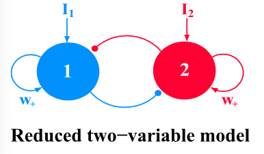
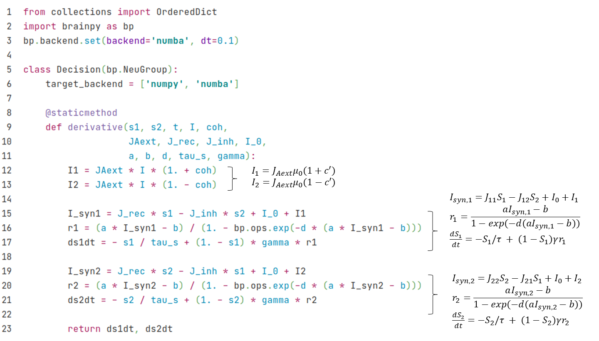
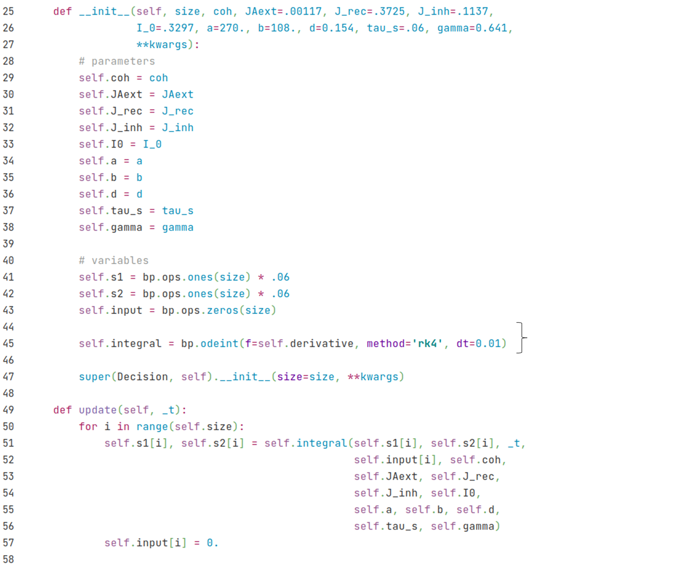
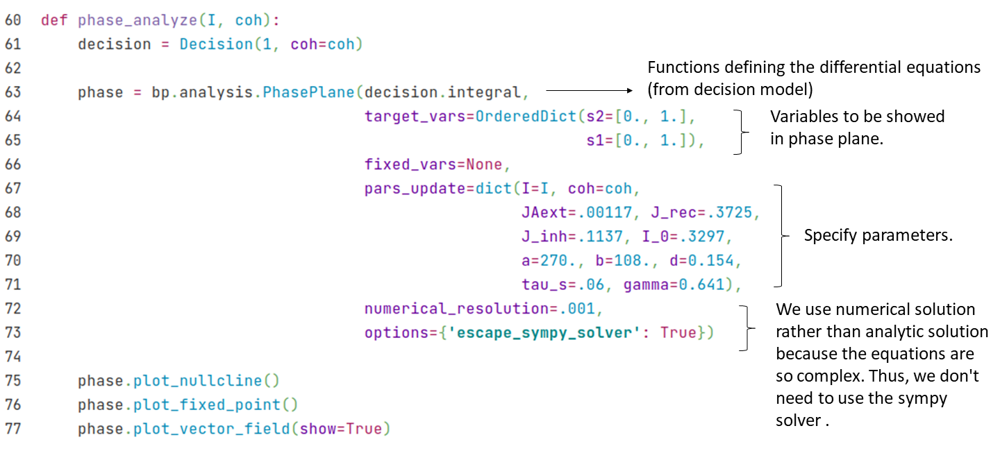

## 3.2 发放率神经网络

### 3.2.1 决择模型

我们在上一节中介绍了Wang（2002）提出的抉择模型，现在来介绍他们后续做的一个基于发放率（firing rate）的简化模型（Wong & Wang, 2006[^1]）。该模型的实验背景与上一节的相同，在脉冲神经网络模型的基础上，他们使用平均场近似（mean-field approach）等方法，使用一群神经元的发放率来表示整个神经元群的状态，而不再关注每个神经元的脉冲。他们拟合出输入-输出函数（input-output function）来表示给一群神经元一个外界输入电流$$I$$时，这群神经元的发放率$$r$$如何改变，即$$r=f(I)$$。经过这样的简化后，我们就可以很方便地对其进行动力学分析。


<div align="center">
  
  <br>
  <strong>图3-1 简化的抉择模型</strong> (引自 <cite>Wong & Wang, 2006 <sup><a href="#fn_1">1</a></sup></cite>)
</div>
<div><br></div>

基于发放率的抉择模型如图3-1所示，$$S_1$$（蓝色）和$$S_2$$（红色）分别表示两群神经元的状态，同时也分别对应着两个选项。他们都由兴奋性的神经元组成，且各自都有一个循环（recurrent）连接。而同时它们都会给对方一个抑制性的输入，以此形成相互竞争的关系。该模型的动力学方程如下：
$$
\frac{dS_1} {dt} = -\frac {S_1} \tau + (1-S_1) \gamma r_1
$$

$$
\frac{dS_2} {dt} = -\frac {S_2} \tau + (1-S_2) \gamma r_2
$$

其中$$\tau$$为时间常数，$$\gamma$$为拟合得到的常数， $$r_1$$ 和 $$r_2$$ 分别为两群神经元的发放率，其输入-输出函数为：

$$
r_i = f(I_{syn, i})
$$

$$
f(I)= \frac {aI-b} {1- \exp [-d(aI-b)]}
$$

$$I_{syn, i}$$ 的公式由图3-1的模型结构给出：

$$
I_{syn, 1} = J_{11} S_1 - J_{12} S_2 + I_0 + I_1
$$

$$
I_{syn, 2} = J_{22} S_2 - J_{21} S_1 + I_0 + I_2
$$


其中$$I_0$$为背景电流，外界输入 $$I_1, I_2$$ 则由总输入的强度 $$\mu_0$$ 及一致性（coherence） $$c'$$ 决定。一致性越高，则越明确$$S_1$$是正确答案，而一致性越低则表示越随机。公式如下：

$$
I_1 = J_{\text{A, ext}} \mu_0 (1+\frac {c'}{100\%})
$$

$$
I_2 = J_{\text{A, ext}} \mu_0 (1-\frac {c'}{100\%})
$$


接下来，我们将继承``bp.NeuGroup``类，并用BrainPy提供的相平面分析方法``bp.analysis.PhasePlane``进行动力学分析。首先，我们把上面的动力学公式写到一个``derivative``函数中，定义一个Decision类。






接下来，我们想要看模型在不同输入情况下的动力学，因此，我们先定义一个对抉择模型做相平面分析的方法，可以让我们改变``I``（即外界输入强度$$\mu_0$$）和``coh``（即输入的一致性$$c'$$），而固定了参数的值等。




现在让我们来看看当没有外界输入，即$$\mu_0 = 0$$时的动力学。


```python
phase_analyze(I=0., coh=0.)
```

    plot nullcline ...
    plot fixed point ...
    Fixed point #1 at s2=0.06176109215560733, s1=0.061761097890810475 is a stable node.
    Fixed point #2 at s2=0.029354239100062428, s1=0.18815448592736211 is a saddle node.
    Fixed point #3 at s2=0.0042468423702408655, s1=0.6303045696241589 is a stable node.
    Fixed point #4 at s2=0.6303045696241589, s1=0.004246842370235128 is a stable node.
    Fixed point #5 at s2=0.18815439944520335, s1=0.029354240536530615 is a saddle node.
    plot vector field ...


由此可见，用BrainPy进行动力学分析是非常方便的。向量场和不动点 (fixed point)表示了不同初始值下最终会落在哪个选项。

这里，x轴是$$S_2$$，代表选项2，y轴是$$S_1$$，代表选项1。可以看到，左上的不动点 表示选项1，右下的不动点表示选项2，左下的不动点表示没有选择。

现在让我们看看当我们把外部输入强度固定为30时，在不同一致性（coherence）下的相平面。


```python
# coherence = 0%
print("coherence = 0%")
phase_analyze(I=30., coh=0.)

# coherence = 51.2%
print("coherence = 51.2%")
phase_analyze(I=30., coh=0.512)

# coherence = 100%
print("coherence = 100%")
phase_analyze(I=30., coh=1.)
```

    coherence = 0%
    plot nullcline ...
    plot fixed point ...
    Fixed point #1 at s2=0.6993504413889349, s1=0.011622049526766405 is a stable node.
    Fixed point #2 at s2=0.49867489858358865, s1=0.49867489858358865 is a saddle node.
    Fixed point #3 at s2=0.011622051540013889, s1=0.6993504355529329 is a stable node.
    plot vector field ...


    coherence = 51.2%
    plot nullcline ...
    plot fixed point ...
    Fixed point #1 at s2=0.5673124813731691, s1=0.2864701069327971 is a saddle node.
    Fixed point #2 at s2=0.6655747347157656, s1=0.027835279565912054 is a stable node.
    Fixed point #3 at s2=0.005397687847426814, s1=0.7231453520305031 is a stable node.
    plot vector field ...


    coherence = 100%
    plot nullcline ...
    plot fixed point ...
    Fixed point #1 at s2=0.0026865954387078755, s1=0.7410985604497689 is a stable node.
    plot vector field ...


### 3.2.2 连续吸引子模型（CANN）

这里我们将介绍发放率模型的另一个例子——连续吸引子神经网络（CANN）。一维CANN的结构如下：

<div align="center">
  
  <br>
  <strong>图3-2 连续吸引子神经网络</strong> (引自 <cite>Wu et al., 2008 <sup><a href="#fn_2">2</a></sup></cite>)
</div>
<div><br></div>

神经元群的突触总输入$$u$$的动力学方程如下：
$$
\tau \frac{du(x,t)}{dt} = -u(x,t) + \rho \int dx' J(x,x') r(x',t)+I_{ext}
$$

其中x表示神经元群的参数空间位点，$$r(x', t)$$为神经元群(x')的发放率，由以下公式给出:

$$
r(x,t) = \frac{u(x,t)^2}{1 + k \rho \int dx' u(x',t)^2}
$$

而神经元群(x)和(x')之间的兴奋性连接强度$$J(x, x')$$由高斯函数给出:

$$
J(x,x') = \frac{1}{\sqrt{2\pi}a}\exp(-\frac{|x-x'|^2}{2a^2})
$$

外界输入$$I_{ext}$$与位置$$z(t)$$有关，公式如下：

$$
I_{ext} = A\exp\left[-\frac{|x-z(t)|^2}{4a^2}\right]
$$

用BrainPy实现的代码如下，我们通过继承``bp.NeuGroup``来创建一个``CANN1D``的类。


> 其中函数``dist``与``make_conn``用来计算两群神经元之间的连接强度$$J$$。在``make_conn``函数中，我们首先计算每两个$$x$$之间的距离矩阵。由于神经元群是环状排列的，$$x$$的值介于$$-\pi$$到$$\pi$$之间，所以$$x-x'$$的范围为$$2\pi$$，且$$-\pi$$和$$\pi$$是同一个点（实际最远是$$\pi$$，即0.5*``z_range``，超出的距离需要减去一个``z_range``）。我们用``dist``函数来处理环上的距离。

> 而``get_stimulus_by_pos``函数则是根据参数空间位点``pos``处理外界输入，可供用户在使用时调用获取所需的输入电流大小。例如在简单的群编码（population coding）中，我们给一个``pos=0``的外界输入，并按以下方式运行：


```python
cann = CANN1D(num=512, k=0.1, monitors=['u'])

I1 = cann.get_stimulus_by_pos(0.)
Iext, duration = bp.inputs.constant_current([(0., 1.), (I1, 8.), (0., 8.)])
cann.run(duration=duration, inputs=('input', Iext))
```

由于在之后的运行中，画结果图的代码是一样的，我们写一个``plot_animate``的函数来调用``bp.visualize.animate_1D``。

``` python
# 定义函数
def plot_animate(frame_step=5, frame_delay=50):
    bp.visualize.animate_1D(dynamical_vars=[{'ys': cann.mon.u, 'xs': cann.x,
                                             'legend': 'u'}, {'ys': Iext,
                                             'xs': cann.x, 'legend': 'Iext'}],
                            frame_step=frame_step, frame_delay=frame_delay,
                            show=True)

# 调用函数
plot_animate(frame_step=1, frame_delay=100)
```


可以看到，$$u$$的形状编码了外界输入的形状。

现在我们给外界输入加上随机噪声，看看$$u$$的形状如何变化。


```python
cann = CANN1D(num=512, k=8.1, monitors=['u'])

dur1, dur2, dur3 = 10., 30., 0.
num1 = int(dur1 / bp.backend.get_dt())
num2 = int(dur2 / bp.backend.get_dt())
num3 = int(dur3 / bp.backend.get_dt())
Iext = np.zeros((num1 + num2 + num3,) + cann.size)
Iext[:num1] = cann.get_stimulus_by_pos(0.5)
Iext[num1:num1 + num2] = cann.get_stimulus_by_pos(0.)
Iext[num1:num1 + num2] += 0.1 * cann.A * np.random.randn(num2, *cann.size)
cann.run(duration=dur1 + dur2 + dur3, inputs=('input', Iext))

plot_animate()
```


我们可以看到$$u$$的形状保持一个类似高斯的钟形，这表明CANN可以进行模版匹配。

接下来我们用``np.linspace``函数来产生不同的位置，得到随时间平移的输入，我们将会看到$$u$$跟随着外界输入移动，即平滑追踪。


```python
cann = CANN1D(num=512, k=8.1, monitors=['u'])

dur1, dur2, dur3 = 20., 20., 20.
num1 = int(dur1 / bp.backend.get_dt())
num2 = int(dur2 / bp.backend.get_dt())
num3 = int(dur3 / bp.backend.get_dt())
position = np.zeros(num1 + num2 + num3)
position[num1: num1 + num2] = np.linspace(0., 12., num2)
position[num1 + num2:] = 12.
position = position.reshape((-1, 1))
Iext = cann.get_stimulus_by_pos(position)
cann.run(duration=dur1 + dur2 + dur3, inputs=('input', Iext))

plot_animate()
```


### 参考资料

[^1]: Wong, K.-F. & Wang, X.-J. A Recurrent Network Mechanism of Time Integration in Perceptual Decisions.  J. Neurosci. 26, 1314–1328 (2006).
[^2]: Si Wu, Kosuke Hamaguchi, and Shun-ichi Amari. "Dynamics and computation of continuous attractors." Neural computation 20.4 (2008): 994-1025.