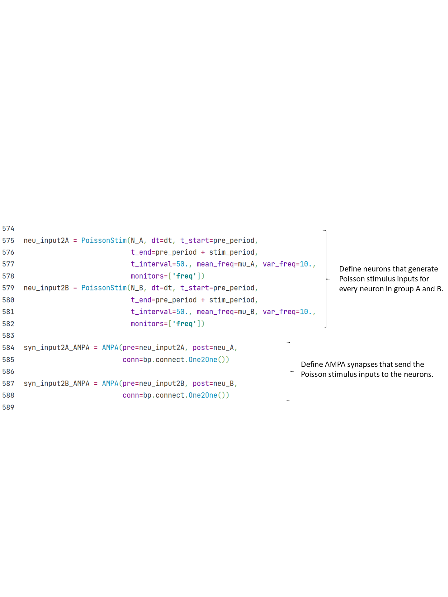

## 3.1 脉冲神经网络

### 3.1.1 兴奋-抑制平衡网络

上世纪90年代，生物学实验上发现，在大脑皮层中的神经活动经常表现出一种时间上无规则的发放模式。这种发放模式广泛地存在在脑区中，但当时学界对它的机制和功能都了解不多。

Vreeswijk和Sompolinsky（1996）提出了**兴奋-抑制平衡网络**（E/I balanced network）来解释这种不规则的发放模式。兴奋-抑制平衡网络的结构特征是神经元之间强的随机稀疏突触连接，由于这种结构和对应的参数设置，网络中每个神经元都会接收到很大的来自网络内部的兴奋性和抑制性输入。但是，这两种输入将会相互抵消，最后神经元接收到的总输入将保持在一个相对小的数量级上，仅足以让膜电位上升到阈值电位，引发神经元的发放。

网络结构上的随机性和噪声的共同作用，使得兴奋-抑制平衡网络中的每一个神经元都接收到随时间和空间变化的、阈值电位量级的输入。这样，神经元的发放也具有了随机性，保证兴奋-抑制平衡网络能够自发产生时间上不规则的发放模式。

<b>Fig.3-1 Structure of E/I balanced network | Vreeswijk and Sompolinsky, 1996</b>

Vreeswijk和Sompolinsky同时也提出了这种发放模式一个可能的功能：兴奋-抑制平衡网络可以对外部刺激的变化快速做出反应。

如图3-3所示，当没有外部输入时，兴奋-抑制平衡网络中的神经元膜电位在静息电位$$V_0$$和阈值电位$$\theta$$之间服从一个相对均匀的随机分布。

<b>Fig.3-2 Distribution of neuron membrane potentials in E/I balanced network | Tian et al., 2020</b>

当我们给网络一个小的恒定外部输入时，那些膜电位原本就落在阈值电位附近的神经元收到这一输入就会很快发放。在网络尺度上，表现为网络的发放率随输入变化而快速改变。

仿真证实，在这种情况下，网络对输入反应的延迟时长，和突触延迟的时长在同一量级，并且二者都远小于一个单神经元面对同样大小的外部输入、从静息电位积累到产生动作电位所需的时间。因此，兴奋-抑制平衡网络可能为神经网络提供了一种快速反应的机制。

图3-1画出了兴奋-抑制平衡网络的结构：

1）神经元实现为LIF模型。神经元可以被分为兴奋性神经元和抑制性神经元，两种神经元的比例是$$N_E$$: $$N_I$$ = 4:1。

2）突触实现为指数型突触。在上述的两类神经元中，产生了四类突触连接：兴奋-兴奋连接（E2E conn），兴奋-抑制连接（E2I conn），抑制-兴奋连接（I2E conn），抑制-抑制连接（I2I conn）。定义符号相反的突触权重来区分兴奋性和抑制型的突触连接。

	

3）输入：网络中的所有神经元接受到一个恒定的外部输入。

	

LIF神经元和指数型突触的实现请参见上面两节。在仿真完成后，我们画出兴奋-抑制平衡网络的发放情况，可以看到网络从一开始的强同步性发放渐渐变为无规则波动。

	

<b>Fig.3-3 E/I balanced net raster plot</b>

### 3.1.2 决策网络

计算神经科学的网络建模也可以对标特定的生理实验任务。比如，在视觉运动区分任务（Roitman和Shadlen，2002）中，猕猴将观看一段视频，视频中特定区域内的随机点以一定比例向左或向右运动。猕猴被要求判断朝哪个方向运动的点更多，并通过眼动给出答案。同时，研究者用植入电极记录猕猴LIP神经元的活动。

 

<b>Fig.3-4 Experimental Diagram</b>

Wang（2002）提出了决策网络来建模在如上任务的决策过程中，猕猴LIP神经元的活动。

如图3-5所示，网络同样基于兴奋-抑制平衡网络。兴奋性神经元和抑制型神经元的数量比是$$N_E:N_I = 4:1$$，调整参数使得网络处在平衡状态下。

为了完成决策任务，在兴奋性神经元群中，选出两个选择性子神经元群A和B，大小均为兴奋性神经元群的0.15倍（$$N_A = N_B = 0.15N_E$$）。这两个子神经元群在下图中被标为A和B，其他的兴奋性神经元被称为非选择性的神经元，其数目为$$N_{non} = (1-2*0.15)N_E$$。

<b>Fig.3-5 structure of decision makingnetwork</b>

	

决策网络中共有四组突触——E2E，E2I，I2E和I2I突触连接，其中兴奋性突触实现为AMPA突触，抑制性突触实现为GABAa突触。

由于网络需要在两个选项（子神经元群A和B）之间做出决策，必须要区分这两个子神经元群。一个选择性的子神经元群应当激活自身，并同时抑制另一个子神经元群。

因此，网络中的E2E连接被建模为有结构的连接。如表3-1所示，$$w+ > 1 > w-$$。通过这种方法，在一个选择性子神经元群之内，通过更强的兴奋性突触连接达成了一种相对的激活，而在选择性子神经元群之间或是选择性和非选择性子神经元群间，更弱的兴奋性突触连接实际上形成了相对的抑制。A和B两个神经元因此形成了竞争关系，迫使网络做出二选一的决策。

<b>Sheet 3-1 Weight of synapse connections between E-neurons</b>

	

决策网络收到两种外部输入：

1）从其他脑区传来的非特定的背景输入，表示为AMPA突触介导的高频泊松输入（2400Hz）。

	

2）仅两个选择性子神经元群A和B收到的外部传来的刺激输入。表示为AMPA突触介导的较低频率的泊松输入。

给予A和B神经元群的泊松输入的频率（$$\mu_A$$、$$\mu_B$$）有一定差别，对应着生理实验中朝两个方向运动的随机点的比例差别，引导网络在两个子神经元群中进行决策。
$$
\rho_A = \rho_B = \mu_0/100
$$

$$
\mu_A = \mu_0 + \rho_A * c
$$

$$
\mu_B = \mu_0 + \rho_B * c
$$

每50毫秒，泊松输入的频率$$f_x$$遵循由均值$$\mu_x$$ 和方差$$\delta^2$$定义的高斯分布，重新进行一次随机采样。
$$
f_A \sim N(\mu_A, \delta^2)
$$

$$
f_B \sim N(\mu_B, \delta^2)
$$

	

	

在仿真时，子神经元群A收到的刺激输入比B收到的更大。在一定延迟时间之后，A群的活动水平明显高于B群，说明网络做出了正确的选择。

<b>Fig.3-6 decision making network</b>

