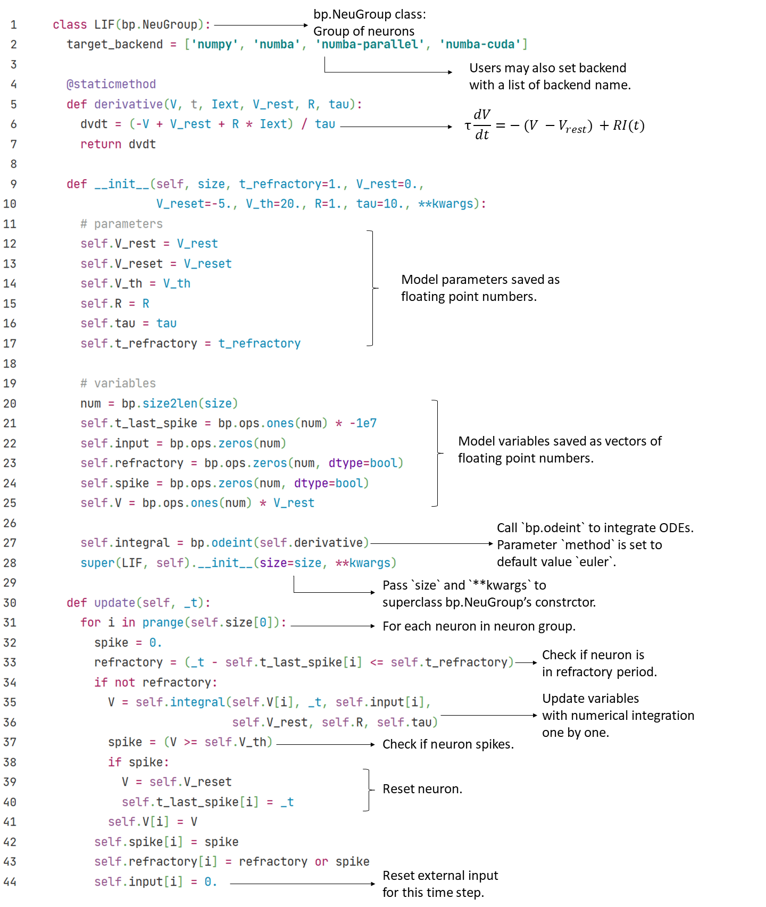

## 1.3 简化模型

启发自生理实验的Hodgkin-Huxley模型准确但昂贵，因此，研究者们提出了简化模型，希望能降低仿真的运行时间和计算资源消耗。

简化模型的特点是简单、易于计算，同时仍可复现神经元发放的主要特征。尽管它们的表示能力常常不如生理模型，但因为其简洁性，研究者们有时也可以接受一定的精度损失。

本节将从简单到复杂，依次介绍：泄露积分-发放模型、二次积分-发放模型、指数积分-发放模型、适应性指数积分-发放模型、Hindmarsh-Rose模型和归纳积分-发放模型。

### 1.3.1 泄漏积分-发放模型

最经典的简化模型，莫过于Lapicque（1907）提出的**泄漏积分-发放模型**（Leaky Integrate-and-Fire model, **LIF model**）。LIF模型是由微分方程表示的积分过程和由条件判断表示的发放过程的结合：
$$
\tau\frac{dV}{dt} = - (V - V_{rest}) + R I(t)
$$
If  $$V > V_{th}$$, neuron fires, 
$$
V \gets V_{reset}
$$
其中$$\tau = RC$$是LIF模型的时间常数，$$\tau$$越大，模型的动力学就越慢。LIF模型同样可以对应到等效电路图上，但比HH模型的等效电路更加简单，因为它不再建模钠离子通道和钾离子通道。实际上，LIF模型中只有电阻$$R$$，电容$$C$$，电源$$V_{rest}$$和外部输入$$I$$被建模。

<b>Fig1-4 Equivalent circuit of LIF model</b>

尽管LIF模型可以产生动作电位，但没有建模动作电位的形状。在发放动作电位前，LIF神经元膜电位的增长速度将逐渐降低，而并非像真实神经元那样先缓慢增长，在跨过阈值电位之后转为迅速增长。

原始LIF模型还忽略了不应期。要模拟不应期，必须再补充一个条件判断：如果当前时刻距离上次发放的时间小于不应期时长，则神经元处于不应期，膜电位$$V$$不再更新。

------

### 1.3.2 二次积分-发放模型

LIF模型固然简洁，但像上一节末尾所讲的那样，有着诸多限制。为了弥补它在表示能力上的缺陷，Latham等人（2000）提出了**二次积分-发放模型**（Quadratic Integrate-and-Fire model，**QuaIF model**）。在QuaIF模型中，微分方程右侧的二阶项使得神经元能产生和真实神经元更“像”的动作电位。
$$
\tau\frac{d V}{d t}=a_0(V-V_{rest})(V-V_c) + RI(t)
$$

在上式中，$$a_0$$和$$V_C$$共同控制着动作电位的初始化，其中，$$a_0$$控制着发放前膜电位的增长速度，也即膜电位相对时间变化的斜率；$$V_c$$是动作电位初始化的临界值，当膜电位$$V$$低于 $$V_C$$时，$$V$$缓慢增长，一旦越过 $$V_C$$， $$V$$就转为迅速增长。

------

### 1.3.3 指数积分-发放模型

**指数积分-发放模型**（Exponential Integrate-and-Fire model,  **ExpIF model**）（Fourcaud-Trocme et al., 2003）在QuaIF模型的基础上更上一层，进一步提升了模型生成的动作电位的真实度。
$$
\tau \frac{dV}{dt} = - (V - V_{rest}) + \Delta_T e^{\frac{V - V_T}{\Delta_T}} + R I(t)
$$

在指数项中$$V_T$$是动作电位初始化的临界值，在其下$$V$$缓慢增长，其上$$V$$迅速增长。$$\Delta_T$$是ExpIF模型中动作电位的斜率。当$$\Delta_T\to 0$$时，ExpIF模型中动作电位的形状将趋近于$$V_{th} = V_T$$的LIF模型（Fourcaud-Trocme et al.，2003）。

在上图中可以看到，ExpIF模型中膜电位相对于时间的斜率在每次上升到$$V_T$$值（-59.9mV）附近时，都发生了一个明显的转变，这是由于微分方程中指数项的调控。比起QuaIF模型，这种转变显得更加自然。

------

### 1.3.4 适应性指数积分-发放模型

在以上诸积分-发放模型中，建模了神经元的标准动作电位，但尚有许多神经元的行为未被涉及。

让我们稍稍离题，请读者做这样一种想象：你独自一人来到夜晚的海边，一开始，你闻到海风里的腥味，忍不住深吸一口气（或者捂住鼻子）。但过了一会儿，不管主观上想要亲近还是远离大海，你再也闻不见这种腥气——或者至少是以为自己闻不见了。这是因为你的嗅觉系统习惯了这种刺激，不再无休无止地提醒你的大脑附近存在着异味了。

上面这个例子中，对鱼腥味发生**适应**的是整个嗅觉感知系统。不过，在单神经元尺度上，也存在类似的行为。当特定类型的神经元面对恒定的外部刺激时，一开始神经元高频发放，随后发放率逐渐降低，最终稳定在一个较小值，这就是神经元的适应行为。

为了复现这种行为，研究者们在已有的积分-发放模型（如LIF、QuaIF和ExpIF模型等）上增加了权重变量$$w$$。这里我们介绍其中的**适应性指数积分-发放模型**（Adaptive Exponential Integrate-and-Fire model，**AdExIF model**）（Gerstner et al.，2014）。
$$
\tau_m \frac{dV}{dt} = - (V - V_{rest}) + \Delta_T e^{\frac{V - V_T}{\Delta_T}} - R w + R I(t)
$$

$$
\tau_w \frac{dw}{dt} = a(V - V_{rest})- w + b \tau_w \sum \delta(t - t^f))
$$

如其名所示，AdExIF模型的第一个微分方程和我们上面介绍的ExpIF模型非常相似，唯一区别是方程右侧增加了控制神经元适应行为的权重项，即$$-Rw$$一项。

权重项中$$w$$受到第二个微分方程的调控。$$a$$描述了权重变量$$w$$对$$V$$的下阈值波动的敏感性，$$b$$表示$$w$$在一次发放后的增长值，另外，$$w$$也随时间衰减。

在这样的一个动力学系统中，给神经元一个恒定输入，在连续数次发放后，$$w$$的值将会上升到一个高点，减慢$$V$$的增长速度，从而降低神经元的发放率。

------

### 1.3.5 Hindmarsh-Rose模型

神经元的行为并不总是符合标准模板的。比如，不是所有神经元都在每次发放后等待一整个不应期才进行第二次发放。有时，部分神经元面对特定类型的输入，能够产生短时间内的连续发放。和以上所有模型产生的**脉冲式发放**相对地，我们称这种发放模式为**爆发**（brusting），或**爆发式发放**（bursting firing）。

为了模拟神经元的爆发，Hindmarsh和Rose（1984）提出了**Hindmarsh-Rose模型**，引入了第三个模型变量$$z$$作为慢变量控制爆发。
$$
\frac{d V}{d t} = y - a V^3 + b V^2 - z + I
$$

$$
\frac{d y}{d t} = c - d V^2 - y
$$

$$
\frac{d z}{d t} = r (s (V - V_{rest}) - z)
$$

式中，变量$$V$$表示膜电位，$$y$$和$$z$$是两个门控变量。在$$dV/dt$$方程中的参数$$b$$允许模型在脉冲式发放和爆发式发放之间切换，并控制脉冲式发放的频率。$$dz/dt$$方程中，参数$$r$$控制慢变量$$z$$的变化速率，影响神经元爆发式发放时，每次爆发包含的动作电位个数，并和参数$$b$$共同控制脉冲式发放的频率；参数$$s$$控制着神经元的适应行为。其它参数根据发放模式拟合得到。

	

下图中画出了$$V$$、$$y$$、$$z$$三个变量随时间的变化。可以看到，慢变量$$z$$的变化速率确实慢于$$V$$和$$y$$。而且，$$V$$和$$y$$在仿真过程中呈近似周期性的变化。

利用BrainPy的理论分析模块`analysis`，我们可以找出这种周期性的产生原因。将慢变量$$z$$近似为常数，则Hindmarsh-Rose模型的二维相图中，变量$$V$$和$$y$$的轨迹趋近于一个极限环。因此，这两个变量的值会沿极限环周期性变化。

------

### 1.3.6 归纳积分-发放模型

**归纳积分-发放模型**（Generalized Integrate-and-Fire model，**GeneralizedIF model**）（Mihalaş et al.，2009）整合了多种发放模式。该模型包括四个变量，能产生二十种发放模式，并通过调参在各模式之间切换。
$$
\tau \frac{d V}{d t} =  - (V - V_{rest}) + R\sum_{j}I_j + RI
$$

$$
\frac{d V_{th}}{d t} = a(V - V_{rest}) - b(V_{th} - V_{th\infty})
$$

$$
\frac{d I_j}{d t} = - k_j I_j, j = {1, 2}
$$

当$$V$$达到$$V_{th}$$时，神经元发放：
$$
I_j \leftarrow R_j I_j + A_j
$$

$$
V \leftarrow V_{reset}
$$

$$
V_{th} \leftarrow max(V_{th_{reset}}, V_{th})
$$

在$$dV/dt$$的方程中，和所有积分-发放模型一样，$$\tau$$表示时间常数，$$V$$表示膜电位，$$V_{rest}$$表示静息电位，$$R$$为电阻，而$$I$$为外部输入。 

不过，在GIF模型中，数目可变的内部电流被加入到方程中，写作$$\sum_j I_j$$一项。每一个$$I_j$$都代表神经元中的一个内部电流，并以速率$$k_j$$衰减。$$R_j$$和$$A_j$$是自由参数，$$R_j$$描述$$I_j$$重置值对发放前$$I_j$$值的依赖，$$A_j$$则是发放后加到$$I_j$$上的一个常数。

阈值电位$$V_{th}$$也是可变的，受两个参数的调控：$$a$$ 描述了$$V_{th}$$对膜电位$$V$$ 的依赖，$$b$$描述了$$V_{th}$$接近阈值电位在时间趋近于无穷大时的值$$V_{th_{\infty}}$$的速率。$$V_{th_{reset}}$$是当神经元发放时，阈值电位被重置到的值。

	

	

