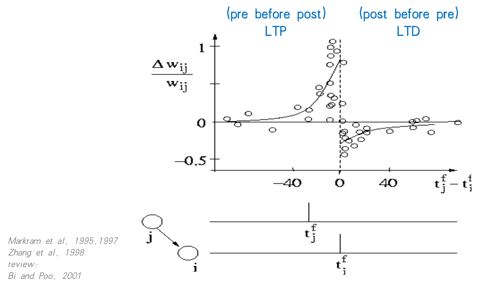
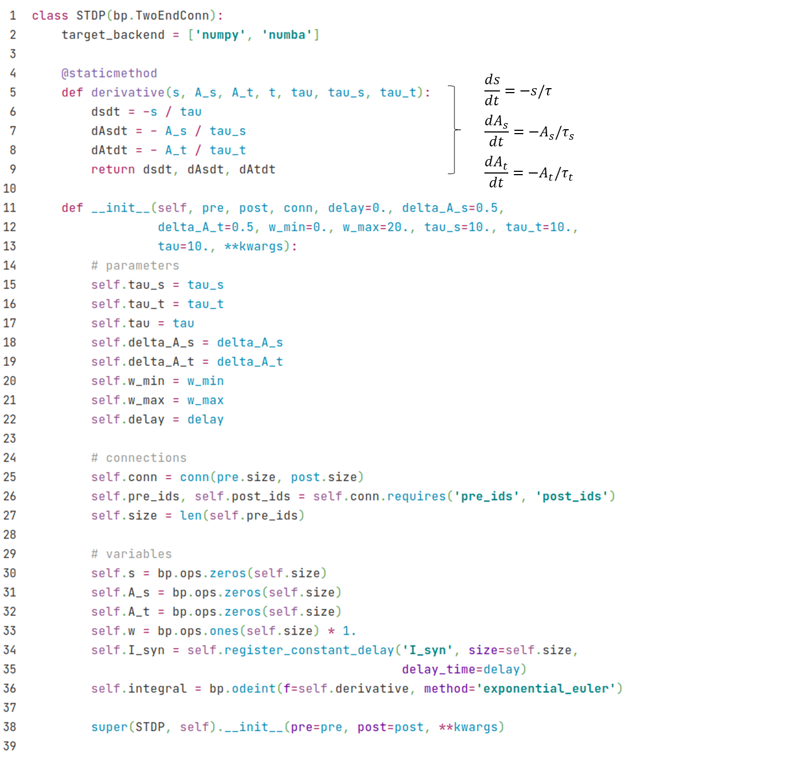
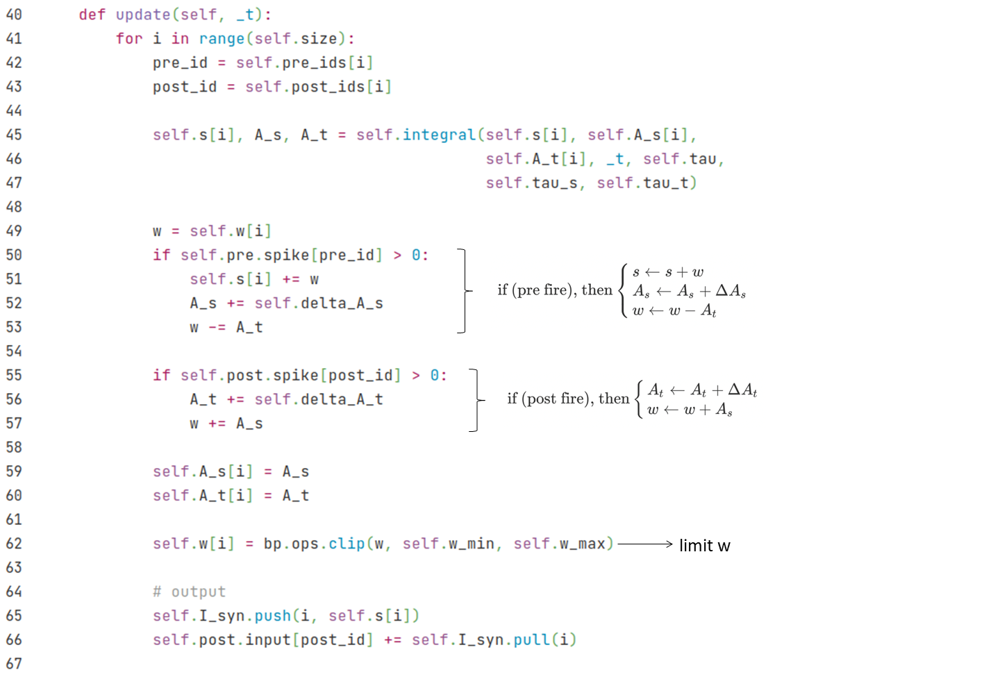
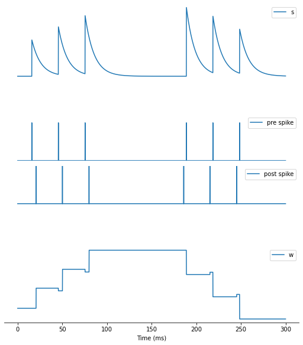
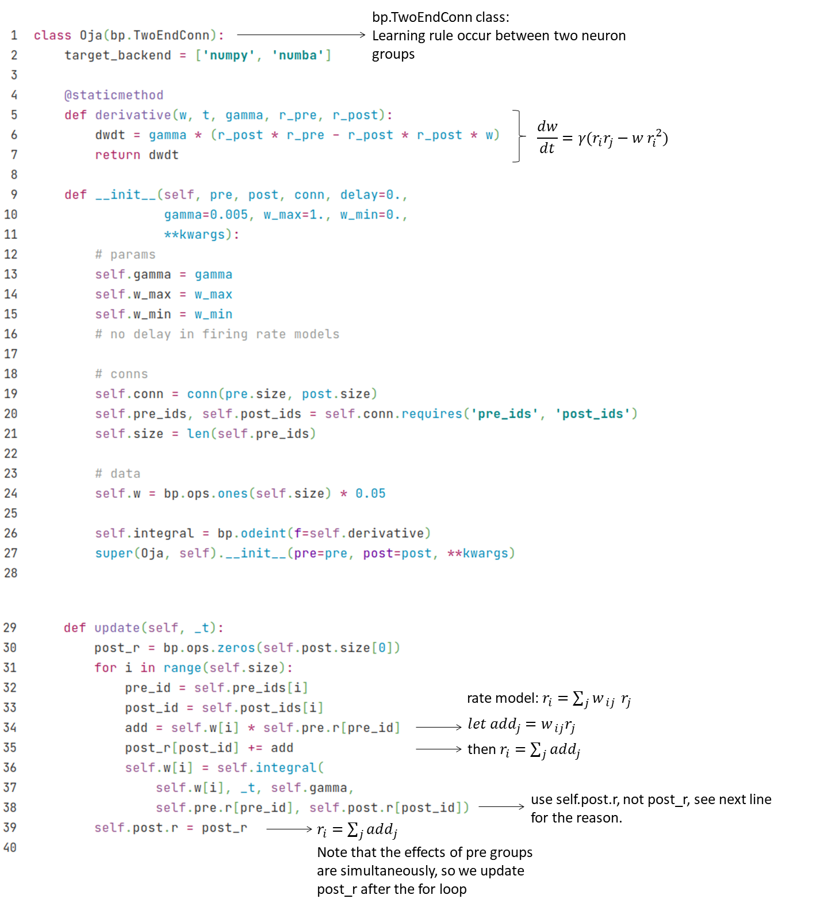
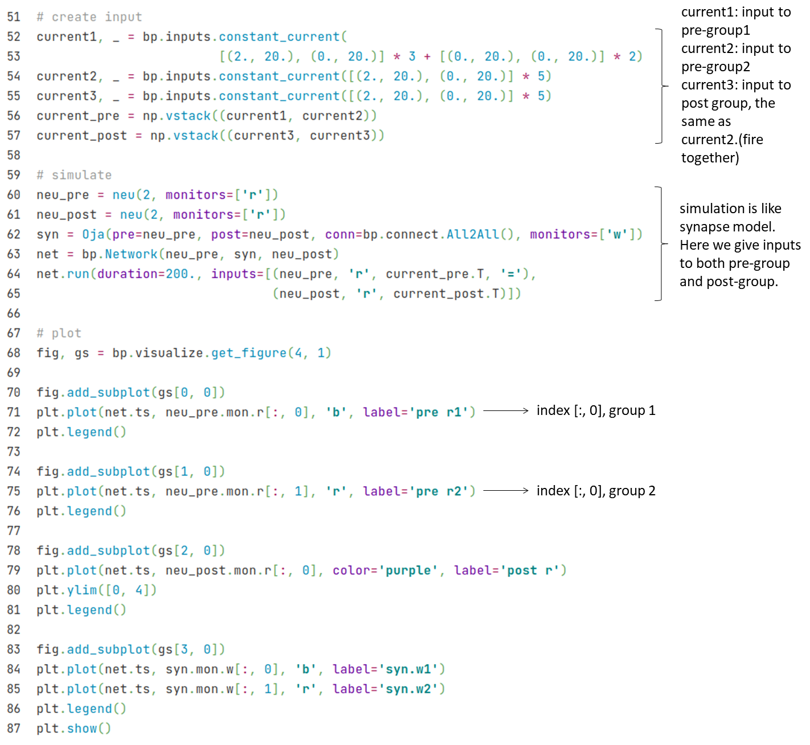

## 2.2 突触可塑性

在前一节中，我们讨论了突触动力学，但还没有涉及到突触可塑性。接下来我们将在本节中介绍如何使用BrainPy来实现突触可塑性。

可塑性主要分为短时程可塑性（short-term plasticity）与长时程可塑性（long-term plasticity）。我们将首先介绍突触短时程可塑性，然后介绍几种不同的突触长时程可塑性模型。


### 2.2.1 突触短时程可塑性（STP）

我们首先从实验结果来介绍突触短时程可塑性。在图2-1中，上图表示突触前神经元的动作电位，下图为突触后神经元的膜电位。我们可以看到，当突触前神经元在短时间内持续发放的时候，突触后神经元的反应越来越弱，呈现出短时程抑制 (short term depression)。而当突触前神经元停止发放几百毫秒后，再来一个动作电位，此时突触后神经元的反应基本恢复到一开始的状态，因此这个抑制效果持续的时间很短，称为短时程可塑性。

<div style="text-align:center">
  
  <br>
  <strong>图2-1 突触短时程可塑性</strong> (改编自 <cite  id="reffn_1">Gerstner et al., 2014 <sup><a href="#fn_1">1</a></sup></cite>)
</div>
<div><br></div>

那么接下来就让我们来看看描述短时称可塑性的计算模型。短时程可塑性主要由神经递质释放的概率$$u$$和神经递质的剩余量$$x$$两个变量来描述。整体的动力学方程如下：
$$
\frac {dI} {dt} = - \frac I {\tau}
$$

$$
\frac {du} {dt} = - \frac u {\tau_f} 
$$

$$
\frac {dx} {dt} =  \frac {1-x} {\tau_d} 
$$

$$
\text{if (pre fire), then}
\begin{cases} 
u^+ = u^- + U(1-u^-) \\ 
I^+ = I^- + Au^+x^- \\
x^+ = x^- - u^+x^- 
\end{cases}
$$

其中，突触电流$$I$$的动力学可以采用上一节介绍的任意一种$$s$$的动力学模型，这里我们采用简单、常用的单指数衰减（single exponential decay）模型来描述。$$U$$和$$A$$分别为$$u$$和$$I$$的增量，而$$\tau_f$$和$$\tau_d$$则分别为$$u$$和$$x$$的时间常数。

在该模型中，$$u$$主要贡献了短时程易化（Short-term facilitation；STF），它的初始值为0，并随着突触前神经元的每次发放而增加；而$$x$$则主要贡献短时程抑制（Short-term depression；STD），它的初始值为1，并在每次突触前神经元发放时都会被用掉一些（即减少）。易化和抑制两个方向是同时发生的，因此$$\tau_f$$和$$\tau_d$$的大小关系决定了可塑性的哪个方向起主导作用。

用BrainPy实现的代码如下：

> - 由于突触可塑性也是发生在突触上的，这里和突触模型一样，继承自bp.TwoEndConn


定义好STP的类以后，接下来让我们来定义跑模拟的函数。跟突触模型一样，我们需要实例化两个神经元群并把它们连接在一起。结果画图方面，除了$$s$$的动力学以外，我们也希望看到$$u$$和$$x$$随时间的变化，因此我们制定``monitors=['s', 'u', 'x']``。

``` python
def run_stp(**kwargs):
    neu1 = bm.neurons.LIF(1, monitors=['V'])
    neu2 = bm.neurons.LIF(1, monitors=['V'])

    syn = STP(pre=neu1, post=neu2, conn=bp.connect.All2All(),
              monitors=['s', 'u', 'x'], **kwargs)
    net = bp.Network(neu1, syn, neu2)
    net.run(100., inputs=(neu1, 'input', 28.))

    # plot
    fig, gs = bp.visualize.get_figure(2, 1, 3, 7)

    fig.add_subplot(gs[0, 0])
    plt.plot(net.ts, syn.mon.u[:, 0], label='u')
    plt.plot(net.ts, syn.mon.x[:, 0], label='x')
    plt.legend()

    fig.add_subplot(gs[1, 0])
    plt.plot(net.ts, syn.mon.s[:, 0], label='s')
    plt.legend()

    plt.xlabel('Time (ms)')
    plt.show()
```

接下来，我们设 ``tau_d`` > ``tau_f``，让我们来看看结果。

``` python
run_stp(U=0.2, tau_d=150., tau_f=2.)
```


从结果图中，我们可以看出当设置 $$\tau_d > \tau_f$$时，$$x$$每次用掉以后恢复得很慢，而$$u$$每次增加后很快又衰减下去了，因此从$$s$$随时间变化的图中我们可以看到STD占主导。


接下来看看当我们设置``tau_f`` > ``tau_d``时的结果。

```python
run_stp(U=0.1, tau_d=10, tau_f=100.)
```


结果图显示，当$$\tau_f > \tau_d$$时，$$x$$每次用掉后很快又补充回去了，这表示突触前神经元总是有足够的神经递质可用。同时，$$u$$的衰减非常缓慢，即释放神经递质的概率越来越高，从$$s$$的动力学可以看出STF占主导地位。


### 2.2.2 突触长时程可塑性

#### 脉冲时间依赖可塑性（STDP）

图2-2显示了实验上观察到的脉冲时间依赖可塑性（spiking timing dependent plasticity；STDP）的现象。x轴为突触前神经元和突触后神经元产生脉冲（spike）的时间差，位于零点左侧的数据点为突触前神经元先于突触后神经元发放的情况，由图可见此时突触权重为正，表现出长时程增强 (long term potentiation；LTP）的现象；而零点右侧则是突触后神经元比突触前神经元更先发放的情况，表现出长时程抑制 (long term depression；LTD）。

<div style="text-align:center">
  
  <br>
  <strong>图2-2 脉冲时间依赖可塑性</strong> (改编自 <cite  id="reffn_2">Bi & Poo, 2001 <sup><a href="#fn_2">2</a></sup></cite>)
</div>
<div><br></div>

STDP的计算模型如下：
$$
\frac {dA_s} {dt} = - \frac {A_s} {\tau_s}
$$

$$
\frac {dA_t} {dt} = - \frac {A_t} {\tau_t} 
$$

$$
\text{if (pre fire), then}
\begin{cases} 
s \leftarrow s + w \\
A_s \leftarrow A_s + \Delta A_s \\ 
w \leftarrow w - A_t 
\end{cases}
$$

$$
\text{if (post fire), then}
\begin{cases} 
A_t \leftarrow A_t + \Delta A_t \\ 
w \leftarrow w + A_s 
\end{cases}
$$

其中$$w$$为突触权重，$$s$$与上一节讨论的一样为门控变量。与STP模型类似，这里由$$A_{s}$$和$$A_{t}$$两个变量分别控制LTD和LTP。$$\Delta A_s$$ 和 $$\Delta A_t$$分别为$$A_{s}$$ 和 $$A_{t}$$的增量，而$$\tau_s$$ 和 $$\tau_t$$则分别为它们的时间常数。

根据这个模型，当突触前神经元先于突触后神经元发放时，在突触后神经元发放之前，每当突触前神经元有一个脉冲，$$A_s$$便增加，而由于此时突触后神经元没有脉冲，因此$$A_t$$保持在初始值0，$$w$$暂时不会有变化。直到突触后神经元发放时，$$w$$的增量将会是$$A_s - A_t$$，由于$$A_s>A_t$$，此时会表现出长时程增强（LTP）。反之亦然。

现在让我们看看如何使用BrainPy来实现这个模型。其中$$s$$动力学的实现部分，我们跟STP模型一样采用单指数衰减模型。





我们通过给予突触前和突触后的两群神经元不同的电流输入来控制它们产生脉冲的时间。首先我们在$$t=5ms$$时刻给突触前神经元第一段电流（每一段强度为30 $$\mu A$$，并持续15ms，保证LIF模型会产生一个脉冲），然后在$$t=10ms$$才给突触后神经元一个输入。每段输入之间间隔$$15ms$$。以此在前三对脉冲中保持$$t_{post}=t_{pre}+5$$。接下来我们设置一个较长的间隔，然后把刺激顺序调整为$$t_{post}=t_{pre}-3$$。


```python
duration = 300.
(I_pre, _) = bp.inputs.constant_current([(0, 5), (30, 15),   # pre at 5ms
                 (0, 15), (30, 15),  
                 (0, 15), (30, 15),
                 (0, 98), (30, 15),  # switch order: t_interval=98ms
                 (0, 15), (30, 15),
                 (0, 15), (30, 15),
                 (0, duration-155-98)])
(I_post, _) = bp.inputs.constant_current([(0, 10), (30, 15), # post at 10 
                  (0, 15), (30, 15),
                  (0, 15), (30, 15),
                  (0, 90), (30, 15), # switch order: t_interval=98-8=90(ms)
                  (0, 15), (30, 15),
                  (0, 15), (30, 15),
                  (0, duration-160-90)])
```

接下来跑模拟的代码和STP类似，这里我们画出突触前后神经元的脉冲时间以及$$s$$和$$w$$随时间的变化。

``` python
pre = bm.neurons.LIF(1, monitors=['spike'])
post = bm.neurons.LIF(1, monitors=['spike'])

syn = STDP(pre=pre, post=post, conn=bp.connect.All2All(),
           monitors=['s', 'w'])
net = bp.Network(pre, syn, post)
net.run(duration, inputs=[(pre, 'input', I_pre), (post, 'input', I_post)])

# plot
fig, gs = bp.visualize.get_figure(4, 1, 2, 7)

def hide_spines(my_ax):
    plt.legend()
    plt.xticks([])
    plt.yticks([])
    my_ax.spines['left'].set_visible(False)
    my_ax.spines['right'].set_visible(False)
    my_ax.spines['bottom'].set_visible(False)
    my_ax.spines['top'].set_visible(False)

ax=fig.add_subplot(gs[0, 0])
plt.plot(net.ts, syn.mon.s[:, 0], label="s")
hide_spines(ax)

ax1=fig.add_subplot(gs[1, 0])
plt.plot(net.ts, pre.mon.spike[:, 0], label="pre spike")
plt.ylim(0, 2)
hide_spines(ax1)
plt.legend(loc = 'center right')

ax2=fig.add_subplot(gs[2, 0])
plt.plot(net.ts, post.mon.spike[:, 0], label="post spike")
plt.ylim(-1, 1)
hide_spines(ax2)

ax3=fig.add_subplot(gs[3, 0])
plt.plot(net.ts, syn.mon.w[:, 0], label="w")
plt.legend()
# hide spines
plt.yticks([])
ax3.spines['left'].set_visible(False)
ax3.spines['right'].set_visible(False)
ax3.spines['top'].set_visible(False)

plt.xlabel('Time (ms)')
plt.show()
```




结果正如我们所预期的，在150ms前，突触前神经元的脉冲时间在突触后神经元之前，$$w$$增加，呈现LTP。而150ms后，突触后神经元先于突触前神经元发放，$$w$$减少，呈现LTD。


#### Oja法则

接下来我们看基于赫布学习律（Hebbian learning）的发放率模型 (firing rate model)。赫布学习律认为相互连接的两个神经元在经历同步的放电活动后，它们之间的突触连接就会得到增强。而这个同步不需要在意两个神经元前后发放的次序，因此可以忽略具体的发放时间，简化为发放率模型。我们首先看赫布学习律的一般形式，对于$$j$$到$$i$$的连接，用$$r_j$$和$$r_i$$分别表示前神经元组和后神经元组的发放率，根据赫布学习律的局部性（locality）特性，$$w_{ij}$$的变化受$$w$$本身及$$r_j, r_i$$的影响，得以下微分方程：

$$
\frac d {dt} w_{ij} = F(w_{ij}; r_{i},r_j)
$$

把上式右边经过泰勒展开可得下式：

$$
\frac d {dt} w_{ij} = c_{00} w_{ij} + c_{10} w_{ij} r_j + c_{01} w_{ij} r_i + c_{20} w_{ij} r_j ^2 + c_{02} w_{ij} r_i ^2 + c_{11} w_{ij} r_i r_j + O(r^3)
$$

赫布学习律的关键在于第六项，只有当第六项的系数$$c_{11}$$非0才满足赫布学习律的同步发放。上式给出了赫布学习律的一般形式，接下来我们看一个具体的例子。

**Oja法则**的公式如下，对应于上式第5、6项系数非零，其中$$\gamma$$为学习速率（learning rate）。
$$
\frac d {dt} w_{ij} = \gamma [r_i r_j - w_{ij} r_i ^2 ]
$$


下面我们用BrainPy来实现Oja法则。



由于Oja法则是发放率模型，它需要突触前后神经元具有变量$$r$$，因此我们定义一个简单的发放率神经元模型来观察两组神经元的学习规则。


我们打算实现如图2-3所示的连接。突触后神经元群$$i$$（紫色）同时接受两群神经元$$j_1$$（蓝色）和$$j_2$$（红色）的输入。我们给$$i$$和$$j_2$$完全相同的刺激，而给$$j_1$$的刺激一开始跟$$i$$一致，但后来就不一致了。因此，根据赫布学习律，我们预期同步发放时，突触权重$$w$$会增加，当$$j_1$$不再与$$i$$同步发放时，则$$w_{ij_1}$$停止增加。

<div style="text-align:center">
  
  <br>
  <strong>图2-3 神经元的连接</strong>
</div>
<div><br></div>




从结果可以看到，在前100ms内，$$j_1$$和$$j_2$$均与$$i$$同步发放，他们对应的$$w_1$$和$$w_2$$也同步增加，显示出LTP。而100ms后，$$j_1$$（蓝色）不再发放，只有$$j_2$$（红色）与$$i$$同步发放，因此$$w_1$$不再增加，$$w_2$$则持续增加。该结果符合赫布学习律。


#### BCM法则

现在我们来看赫布学习律的另一个例子——BCM法则。它的公式如下：
$$
\frac d{dt} w_{ij} =  \eta r_i(r_i - r_\theta) r_j
$$

其中$$\eta$$为学习速率，$$r_\theta$$为学习的阈值（见图2-4）。图2-4画出了上式的右边，当发放频率高于阈值时呈现LTP，低于阈值时则为LTD。因此，这是一种频率依赖可塑性（回想一下，前面介绍的STDP为时间依赖可塑性），可以通过调整阈值$$r_\theta$$实现选择性。


<div style="text-align:center">
  
  <br>
    <strong> 图2-4 BCM法则</strong> (引自 <cite>Gerstner et al., 2014 <sup><a href="#fn_1">1</a></sup></cite>)
</div>
<div><br></div>

我们将实现和Oja法则相同的连接方式（图2-3），但给的刺激不同。在这里，我们让$$j_1$$（蓝色）和$$j_2$$（红色）交替发放，且$$j_1$$的发放率比$$j_2$$高。我们动态调整阈值为$$r_i$$的时间平均，即 $$r_\theta = f(r_i)=\frac {\int dt r_i}T$$。BrainPy实现的代码如下。


定义了BCM类以后，我们可以跑模拟了。

```python
n_post = 1
n_pre = 20

# group selection
group1, duration = bp.inputs.constant_current(([1.5, 1], [0, 1]) * 20)
group2, duration = bp.inputs.constant_current(([0, 1], [1., 1]) * 20)
group1 = bp.ops.vstack(((group1,)*10))
group2 = bp.ops.vstack(((group2,)*10))
input_r = bp.ops.vstack((group1, group2))

pre = neu(n_pre, monitors=['r'])
post = neu(n_post, monitors=['r'])
bcm = BCM(pre=pre, post=post,conn=bp.connect.All2All(),
          monitors=['w'])

net = bp.Network(pre, bcm, post)
net.run(duration, inputs=(pre, 'r', input_r.T, "="))

w1 = bp.ops.mean(bcm.mon.w[:, :10, 0], 1)
w2 = bp.ops.mean(bcm.mon.w[:, 10:, 0], 1)

r1 = bp.ops.mean(pre.mon.r[:, :10], 1)
r2 = bp.ops.mean(pre.mon.r[:, 10:], 1)

fig, gs = bp.visualize.get_figure(2, 1, 3, 12)
fig.add_subplot(gs[1, 0], xlim=(0, duration), ylim=(0, w_max))
plt.plot(net.ts, w1, 'b', label='w1')
plt.plot(net.ts, w2, 'r', label='w2')
plt.title("weights")
plt.ylabel("weights")
plt.xlabel("t")
plt.legend()

fig.add_subplot(gs[0, 0], xlim=(0, duration))
plt.plot(net.ts, r1, 'b', label='r1')
plt.plot(net.ts, r2, 'r', label='r2')
plt.title("inputs")
plt.ylabel("firing rate")
plt.xlabel("t")
plt.legend()

plt.show()
```


结果显示，每次发放率都比较高的$$j_1$$（蓝色），其对应的$$w_1$$持续增加，显示出LTP。而$$w_2$$则呈现出LTD，这个结果显示出BCM法则的选择功能。


### 参考资料

[^1]: Gerstner, Wulfram, et al. Neuronal dynamics: From single neurons to networks and models of cognition. Cambridge University Press, 2014.
[^2]: Bi, Guo-qiang, and Mu-ming Poo. "Synaptic modification by correlated activity: Hebb's postulate revisited." Annual review of neuroscience 24.1 (2001): 139-166.